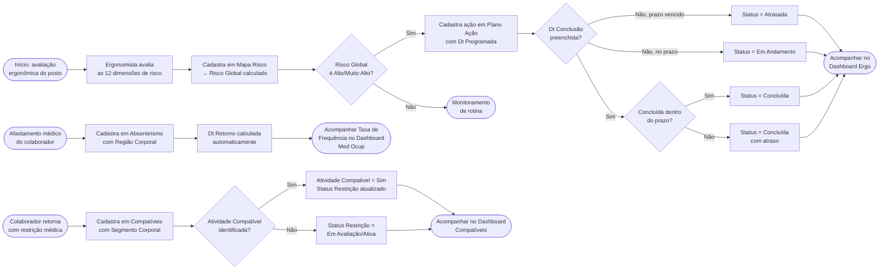
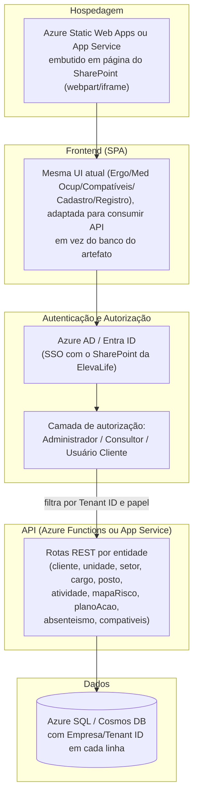
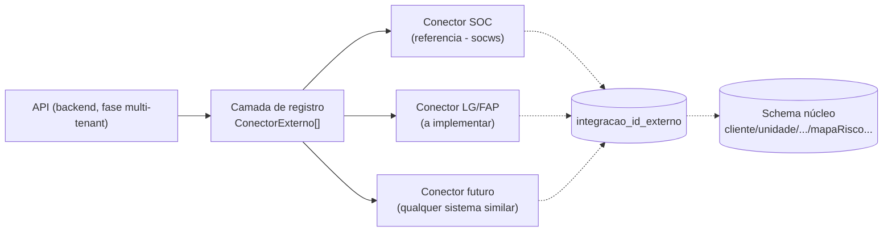

# BI Ergonomia — ElevaLife

Manual de uso, arquitetura e processo (BPMN) do produto **BI Ergonomia**, um
dashboard analítico web, standalone e independente de qualquer cliente,
desenvolvido pela ElevaLife recriando em tecnologia web a especificação do RD
"BI Ergonomia v1.0" (Power BI, W&SBI). Esta build usa **dados fictícios
realistas** — não há integração real com MedSafe/MS Ergo Profissional nem com
o Sistema de Gestão Integrada da ElevaLife nesta fase.

## Sumário

1. [Visão geral](#visão-geral)
2. [Como acessar e navegar](#como-acessar-e-navegar)
3. [Filtros globais x filtros de página](#filtros-globais-x-filtros-de-página)
4. [Dashboard "Ergo"](#dashboard-ergo)
5. [Dashboard "Med Ocup"](#dashboard-med-ocup)
6. [Dashboard "Compatíveis"](#dashboard-compatíveis)
7. [Cadastro (dados mestre) x Registro (lançamento operacional)](#cadastro-dados-mestre-x-registro-lançamento-operacional)
8. [Tabelas de referência](#tabelas-de-referência)
9. [Diagramas corporais — convenção anatômica](#diagramas-corporais--convenção-anatômica)
10. [Modelo de dados](#modelo-de-dados)
11. [Regras de cálculo](#regras-de-cálculo)
12. [Arquitetura em camadas](#arquitetura-em-camadas)
13. [BPMN — processo de gestão de ergonomia](#bpmn--processo-de-gestão-de-ergonomia)
14. [Cobertura dos indicadores do RD](#cobertura-dos-indicadores-do-rd)
15. [Escopo, limitações e próximos passos](#escopo-limitações-e-próximos-passos)
16. [Backlog combinado com Léo (ainda não implementado)](#backlog-combinado-com-léo-ainda-não-implementado)
17. [Próxima fase: multi-tenant, RBAC e hospedagem Azure/SharePoint](#próxima-fase-multi-tenant-rbac-e-hospedagem-azuresharepoint)
18. [Integração com sistemas externos (SOC, LG/FAP e outros)](#integração-com-sistemas-externos-soc-lgfap-e-outros)

---

## Visão geral

O BI Ergonomia reúne em um único painel web os três eixos de gestão de
ergonomia ocupacional:

- **Ergo** — mapa de risco por posto de trabalho e acompanhamento do plano de
  ação corretivo.
- **Med Ocup** — indicadores de absenteísmo e taxa de frequência de
  afastamentos, incluindo a distribuição de dias perdidos por região do corpo.
- **Compatíveis** — gestão de colaboradores com restrição médica e sua
  recolocação em atividades compatíveis.

O produto é **auto-contido**: roda inteiramente no navegador, sem backend
próprio. Os dados operacionais ficam persistidos no banco do próprio artefato
(ver [Arquitetura em camadas](#arquitetura-em-camadas)); as duas tabelas de
referência (Lista CID e Dias Úteis) são estáticas.

## Como acessar e navegar

A navegação fica em um **menu lateral retrátil** (padrão visual ElevaLife —
vinho em gradiente, mesmo estilo do Cockpit Comercial), fixo à esquerda da
tela enquanto o conteúdo rola:

- **Desktop**: o botão "Recolher menu" reduz o menu a um trilho só de
  ícones, ganhando espaço horizontal para os dashboards; a preferência
  (recolhido ou expandido) fica lembrada no navegador para a próxima visita.
- **Telas estreitas (celular/tablet)**: o menu vira uma gaveta deslizante,
  aberta pelo botão de menu (☰) no topo e fechada tocando fora dela ou
  escolhendo um item.

O menu tem 5 itens:

| Item do menu | Conteúdo |
| --- | --- |
| **Ergo** | 9 indicadores de risco e plano de ação (item inicial) |
| **Med Ocup** | 5 indicadores de absenteísmo e taxa de frequência |
| **Compatíveis** | 8 indicadores de restrição médica e recolocação |
| **Cadastro** | Setup dos dados mestre: Cliente, Unidade, Setor, Cargo, Posto de Trabalho, Atividade |
| **Registro** | Lançamento operacional: Mapa Risco, Plano Ação, Absenteísmo, Compatíveis |

**Cadastro** e **Registro** são itens em **árvore retrátil** (mesmo padrão
do menu do Cockpit Comercial): um clique abre, dentro do próprio menu
lateral, a lista das 6 entidades (Cadastro) ou das 4 tabelas (Registro) por
baixo deles; clicar direto num sub-item já leva para aquela entidade/tabela
específica. Só uma árvore fica aberta por vez, e clicar de novo no item já
ativo apenas recolhe/expande a árvore, sem trocar de tela. Em telas
estreitas essa árvore não é necessária — a mesma navegação já existe como
pílulas fixas dentro da própria página de Cadastro/Registro.

No topo da área de conteúdo fica a barra de ações, no mesmo padrão de ícones
do Cockpit Comercial:

- **Filtros** (ícone de funil): recolhe/expande a barra de filtros globais,
  liberando espaço de tela sem perder a seleção feita.
- **Atualizar** (ícone circular): re-renderiza os KPIs, gráficos e tabelas
  com os dados e filtros atuais, sem recarregar a página.
- **PDF** / **Excel** (ver abaixo).

O rodapé traz um link **"Ver tabelas de referência"** que abre, por cima da
tela atual, a consulta somente-leitura de Lista CID e Dias Úteis (ver
[Tabelas de referência](#tabelas-de-referência)).

### Exportar relatório (PDF/Excel)

Os botões **PDF** e **Excel**, sempre visíveis no topo, exportam a **tela
atual**, respeitando os filtros globais (e de página, quando aplicável) já
selecionados:

- **PDF**: gera um relatório com os KPIs e os gráficos exatamente como estão
  na tela (inclui os diagramas corporais, quando presentes na aba).
- **Excel**: gera uma planilha com as linhas brutas filtradas por trás
  daquela tela (a tabela operacional correspondente à aba aberta).

## Filtros globais x filtros de página

- **Filtros globais** (barra fixa no topo, abaixo do cabeçalho): Ano/Mês,
  Cliente, Unidade, Setor, Posto de Trabalho, Cargo, Atividade. Valem para
  **todas as abas** simultaneamente e são cascateados — selecionar um Cliente
  restringe as opções de Unidade/Setor/etc. às combinações que realmente
  existem no Mapa de Risco.
- **Filtros de página** (só na aba Compatíveis, logo abaixo do cabeçalho da
  aba): Status Restrição e Turno de Trabalho. Valem só para os 8 indicadores
  daquela aba e são independentes dos filtros globais.

## Dashboard "Ergo"

9 indicadores, todos reagindo aos filtros globais:

1. Mapa de Risco Global (tiles por nível: Baixo/Médio/Alto/Muito Alto)
2. Top 3 Setores críticos (% de postos em risco Alto/Muito Alto)
3. Plano de Ação — Global (donut por Status Ação)
4. Plano de Ação — Postos Críticos (mesmo donut, restrito a Risco Global =
   Alto/Muito Alto)
5. Plano de Ação por Responsável (barra horizontal empilhada)
6. Ações previstas no período (linha, por Ano/Mês Programado)
7. Ações concluídas no período (linha, por Ano/Mês Concluída)
8. Mapa de Risco por Setor (barra horizontal empilhada por nível)
9. Status do Plano de Ação por Setor (barra horizontal empilhada por status)

## Dashboard "Med Ocup"

5 indicadores:

1. Cards de totais — Qtd Colaboradores, Qtd Dias Perdidos, Taxa de Frequência
2. Evolução da Taxa de Frequência (linha mensal; passe o mouse para ver, no
   mesmo tooltip, a Evolução de Atestados e a Evolução de Dias Perdidos)
3. Taxa de Frequência por Setor (barra)
4. Diagrama corporal — dias perdidos, vista **frontal**
5. Diagrama corporal — dias perdidos, vista **posterior** ("costas")

A Taxa de Frequência segue a metodologia padrão de SST/CIPA (NBR 14280):

```
HHT (Homens-Hora Trabalhados) = Σ (Qtd Colaboradores × Qtd Dias Úteis × 8h)
Taxa de Frequência = (nº de casos de afastamento / HHT) × 1.000.000
```

## Dashboard "Compatíveis"

8 indicadores, todos reagindo aos filtros globais **e** aos filtros de página
(Status Restrição, Turno de Trabalho):

1. Gênero (pizza)
2. Idade (barra vertical, 5 faixas etárias)
3. Status por Setor (barra horizontal empilhada por Status Restrição)
4. Restrição por Turno (barra horizontal empilhada por Status Restrição)
5. Diagrama corporal — restrições, vista **frontal**
6. Diagrama corporal — restrições, vista **posterior**
7. Em Atividade Compatível (pizza Sim/Não)
8. Compatível por Setor (barra horizontal, restrito a Atividade Compatível =
   "Sim")

## Cadastro (dados mestre) x Registro (lançamento operacional)

Seguindo o mesmo padrão do **Cockpit Comercial** (aba Cadastro daquele
produto), o antigo "Cadastros" foi desmembrado em duas abas com propósitos
diferentes — mas com a mesma mecânica de fundo: gravação real no banco do
artefato, visível para qualquer pessoa que abrir o mesmo link.

- **Cadastro** — tela de *setup*: cadastra a estrutura organizacional
  válida do cliente, em 6 sub-abas (uma por entidade): **Cliente**,
  **Unidade**, **Setor**, **Cargo**, **Posto de Trabalho** e **Atividade**.
  É o que precisa existir *antes* de qualquer lançamento operacional.
- **Registro** — tela de *lançamento* (antigo "Cadastros"): as 4 tabelas
  operacionais — Mapa Risco, Plano Ação, Absenteísmo e Compatíveis. É onde
  o dia a dia da operação registra um novo posto avaliado, uma ação, um
  afastamento ou uma restrição.

### Cadastro — dados mestre, fonte única de verdade

Cada sub-aba de Cadastro guarda só os campos até o próprio nível na cadeia
Cliente → Unidade → Setor → {Cargo, Posto de Trabalho → Atividade} — por
exemplo, um registro de Setor tem `Cliente`, `Unidade` e `Setor`; um
registro de Atividade tem os 5 campos até `Atividade`. Juntas, essas 6
coleções são a **fonte única de verdade**: os 6 campos-chave dos 4
formulários de Registro usam **seletores em cascata** validados contra o
Cadastro, em vez de campos de texto livre — isso evita lançar um posto,
cargo ou setor que não existe de fato na estrutura do cliente.

A cascata funciona assim: escolher um Cliente restringe as opções de
Unidade às unidades daquele cliente, e assim por diante. **Cargo** e
**Posto de Trabalho** são irmãos independentes dentro do mesmo Setor (não
existe hierarquia nem filtro mútuo entre os dois no cadastro mestre — a
combinação real dos dois só se forma no lançamento operacional); já
**Atividade** é filha de Posto de Trabalho.

O mesmo motor de cascata atende tanto os formulários de Cadastro (2 a 5
campos, conforme a entidade) quanto os de Registro (os 6 campos completos)
— um formulário com um subconjunto dos campos simplesmente ignora os
níveis que não tem.

### Registro — lançamento operacional

Comportamentos automáticos do formulário:

- **Mapa Risco**: o campo "Risco Global" é **calculado ao vivo** a partir da
  média das 12 dimensões de risco digitadas (nunca digitado à mão). O
  identificador do registro é gerado a partir da chave composta
  Cliente+Unidade+Setor+Posto+Cargo+Atividade — editar essa chave "renomeia"
  o registro internamente.
- **Plano Ação**: ao escolher a chave do posto, o Risco Global é
  **preenchido automaticamente por consulta ao Mapa Risco**; o campo "Fator
  Risco pós Ação" só é habilitado depois que "Dt Conclusão" é preenchida; a
  "Categoria Ação" é sugerida a partir da "Ação Recomendada" escolhida;
  "Status Ação" nunca é digitado — é sempre calculado (ver
  [Regras de cálculo](#regras-de-cálculo)).
- **Absenteísmo**: "Dt Retorno" é calculada automaticamente
  (Dt Afastamento + Qtd Dias); o "Cód CID" sugere a partir da Lista CID.

Se a capacidade de banco de dados não estiver disponível na visualização
atual (por exemplo, uma pré-visualização sem sessão), a aba entra em **modo
somente leitura**: mostra um aviso, desabilita os botões de novo/editar/
excluir e exibe os dados fictícios de exemplo no lugar dos dados reais.

## Tabelas de referência

Lista CID e Dias Úteis são tabelas **estáticas** (não fazem parte do CRUD) e
ficam ocultas do fluxo normal — acessíveis só pelo link "Ver tabelas de
referência" no rodapé, para consulta. Elas alimentam, respectivamente, o
lookup de CID Abrev. no Absenteísmo e a contagem de colaboradores/dias úteis
usada na Taxa de Frequência.

## Diagramas corporais — convenção anatômica

Os 4 diagramas (2 em Med Ocup, 2 em Compatíveis) usam uma silhueta humana
esquemática com caixas tracejadas conectadas por linha-guia a cada região,
gerados por uma **única função parametrizada** (`BI.Diagramas.renderizar`,
em `js/diagramas.js`) — nunca uma função por região.

Convenção adotada (pessoa olhando para o espectador na vista frontal, de
costas para o espectador na vista posterior):

- **Vista frontal**: o lado **Direito da pessoa** aparece à **esquerda da
  imagem** (como em uma foto de frente).
- **Vista posterior ("costas")**: o lado **Direito da pessoa** aparece à
  **direita da imagem**.

Regiões cobertas: Ombro, Cotovelo, Punho, Mão e Pé (D/E) na vista frontal;
Cervical, Dorsal, Lombar, Quadril, Joelho e Tornozelo (D/E onde aplicável) na
vista posterior — 19 regiões no total, as mesmas usadas tanto para "dias
perdidos" (Med Ocup) quanto para "contagem de restrições" (Compatíveis).

## Modelo de dados

O RD original é escrito em linguagem Power BI (tabelas, relacionamentos,
medidas DAX). Esta build **traduz a arquitetura**, e não copia o Power BI ao
pé da letra:

- As 6 tabelas do RD viram estruturas de dados (arrays de objetos) com os
  **mesmos campos**.
- A "Linktable" do RD (chave composta Cliente+Unidade+Setor+Posto+Cargo+
  Atividade[+Ano/Mês]) não existe como tabela à parte — é só a lógica de
  junção entre os arrays, implementada como funções puras de filtro/
  agregação (`Calc.filtrar`, `Calc.buscarPorChave`, `Calc.opcoesDeFiltro`).
- Os blocos de medidas repetidas por região corporal ("Dias perdido
  &lt;REGIÃO&gt;" e "Restrição &lt;REGIÃO&gt;") viram **uma função
  parametrizada por região** (`Calc.somaDiasPorRegiao`,
  `Calc.contagemPorRegiao`), não dezenas de funções quase idênticas.

### Cadastro mestre (6 coleções normalizadas)

Substituem a antiga tabela única "Hierarquia" (6 colunas, 1 linha por
combinação completa). Cada coleção guarda só os campos até o seu próprio
nível:

| Coleção | Campos |
| --- | --- |
| `cliente` | `Cliente` |
| `unidade` | `Cliente`, `Unidade` |
| `setor` | `Cliente`, `Unidade`, `Setor` |
| `cargo` | `Cliente`, `Unidade`, `Setor`, `Cargo` |
| `posto` | `Cliente`, `Unidade`, `Setor`, `Posto Trabalho` |
| `atividade` | `Cliente`, `Unidade`, `Setor`, `Posto Trabalho`, `Atividade` |

`Cargo` e `Posto Trabalho` são irmãos (ambos filhos de `Setor`, sem relação
entre si); `Atividade` é filha de `Posto Trabalho`. É a partir dessas 6
coleções que os seletores em cascata dos 4 formulários de Registro (e dos
próprios formulários de Cadastro) buscam as combinações válidas — ver
[Cadastro (dados mestre) x Registro (lançamento operacional)](#cadastro-dados-mestre-x-registro-lançamento-operacional).

### Lista CID (referência)

`Cód CID`, `CID`, `CID Abrev.`

### Dias Úteis (referência)

`Cliente`, `Unidade`, `Setor`, `Ano/Mês Úteis`, `Qtd Colaboradores`,
`Qtd Dias Úteis`

### Mapa Risco (operacional)

`Cliente`, `Unidade`, `Setor`, `Posto Trabalho`, `Cargo`, `Atividade`,
`Risco Global` (calculado), e as 12 dimensões de risco: Col. Cervical,
Tronco, Ombros, Cotovelos, Punhos, Mãos/Dedos, Joelhos, Pernas, Tornozelos,
Pés/Dedos, Psicossocial/Cognitivo, Ambiental.

### Plano Ação (operacional)

`Cliente`, `Unidade`, `Setor`, `Posto Trabalho`, `Cargo`, `Atividade`,
`Ação Recomendada`, `Gestão Ação`, `Status Ação` (calculado),
`Dt Programada`, `Dt Conclusão`, `Nr Ação`, `Categoria Ação`,
`Responsável Ação`, `E-mail Responsável`, `Auditoria Ergonomista`,
`Dt Auditoria`, `Fator Risco pós Ação`, `Medida Controle ADM`,
`Risco Global`

### Absenteísmo (operacional)

`Cliente`, `Unidade`, `Setor`, `Posto Trabalho`, `Cargo`, `Atividade`,
`Cód CID` (lookup em Lista CID → CID Abrev.), `Dt Afastamento`, `Qtd Dias`,
`Região Corporal`, `Dt Retorno` (calculado = Dt Afastamento + Qtd Dias)

### Compatíveis (operacional)

`Cliente`, `Unidade`, `Setor`, `Posto Trabalho`, `Cargo`, `Atividade`,
`Status Restrição`, `Matrícula`, `Funcionário`, `Turno Trabalho`, `Gênero`,
`Idade`, `Tempo Empresa`, `Responsável Área`, `Médico Avaliador`,
`Queixa Principal`, `Segmento Corporal`, `Restrição Médica`,
`Início/Fim Restrição`, `Histórico Restrição?`, `Doc Atividade Compatível`,
`Retorno Médico`, `Atividade Compatível (recomendada)`,
`Atividade Compatível?` (sim/não)

## Regras de cálculo

### Status Ação (Plano Ação)

Aplicada exatamente conforme o RD, sempre calculada — nunca digitada:

1. `Dt Programada = nulo` **e** `Dt Conclusão = nulo` → **Não Iniciado**
2. `Dt Conclusão = nulo` **e** `Dt Programada < hoje` → **Atrasada**
3. `Dt Programada <= hoje` **e** `Dt Conclusão = nulo` → **Em Andamento**
4. `Dt Conclusão > Dt Programada` → **Concluída com atraso**
5. (implícito) `Dt Conclusão` preenchida e `<= Dt Programada` → **Concluída**

### Risco Global (Mapa Risco)

Média das 12 dimensões de risco (nunca o máximo):

- média ≥ 2,7 → **Muito Alto**
- média ≥ 2,15 → **Alto**
- média ≥ 1,55 → **Médio**
- caso contrário → **Baixo**

### Taxa de Frequência (Med Ocup)

Ver [Dashboard "Med Ocup"](#dashboard-med-ocup) acima (metodologia NBR 14280).

## Arquitetura em camadas

```mermaid
flowchart TB
    subgraph Dados["Camada de Dados"]
        Mock["data/mock_data.json\n(Lista CID + Dias Úteis, estáticas\n+ dados fictícios iniciais)"]
        DB["Banco do artefato (capacidade \"db\")\nCliente · Unidade · Setor · Cargo · Posto · Atividade\n(cadastro mestre) + Mapa Risco · Plano Ação\nAbsenteísmo · Compatíveis (registro)"]
    end
    subgraph Calculo["Camada de Cálculo — js/calc.js"]
        Funcoes["Funções puras:\nfiltrar · buscarPorChave · opcoesDeFiltro\ncalcularStatusAcao · calcularRiscoGlobal\ncalcularTaxaFrequencia · somaDiasPorRegiao\ncontagemPorRegiao · ..."]
    end
    subgraph Diagramas["Camada de Diagramas — js/diagramas.js"]
        SVG["Silhueta SVG parametrizada\n(frente/costas + mapa região→valor)"]
    end
    subgraph Apresentacao["Camada de Apresentação — js/app.js"]
        Menu["Menu lateral retrátil\n(navegação + exportar PDF/Excel)"]
        Filtros["Filtros globais e de página"]
        Graficos["Gráficos (Chart.js) e tiles"]
        CRUD["Cadastro (setup mestre) e\nRegistro (lançamento operacional)\ncom cascata validada pelo cadastro mestre"]
    end

    Mock -->|carga inicial| Funcoes
    DB -->|onSnapshot em tempo real| Funcoes
    Funcoes --> Graficos
    Funcoes --> SVG
    SVG --> Graficos
    Filtros --> Funcoes
    CRUD -->|salvar/excluir| DB
```

Princípio de separação: trocar o mock/DB fictício por integração real com
MedSafe ou o Sistema de Gestão Integrada da ElevaLife no futuro não deve
exigir tocar em `calc.js` nem em `app.js`, desde que a forma das linhas
(mesmos campos e chaves) seja preservada.

## BPMN — processo de gestão de ergonomia

Fluxo de uso ponta a ponta que o BI Ergonomia apoia, do mapeamento de risco
até a recolocação do colaborador:



## Cobertura dos indicadores do RD

O RD original especifica 49 medidas DAX. Como registrado na tradução de
arquitetura, a maioria dessas medidas é a **mesma fórmula repetida por
região corporal** — 19 regiões × 2 blocos ("Dias perdido &lt;REGIÃO&gt;" e
"Restrição &lt;REGIÃO&gt;") = 38 medidas, cobertas aqui por 2 funções
parametrizadas (`Calc.somaDiasPorRegiao` e `Calc.contagemPorRegiao`) em vez
de 38 funções quase idênticas. As 11 medidas restantes correspondem aos
demais KPIs visíveis, todos com equivalente implementado:

| Dashboard | Indicadores (RD) | Implementado |
| --- | --- | --- |
| Ergo | 9 | ✅ 9/9 |
| Med Ocup | 5 (incluindo os 2 diagramas) | ✅ 5/5 |
| Compatíveis | 8 (incluindo os 2 diagramas) | ✅ 8/8 |
| **Total de indicadores visuais** | **22** | **✅ 22/22** |
| Medidas região-a-região (Dias perdido + Restrição) | 38 | ✅ cobertas por 2 funções parametrizadas |

O dado final bate com o RD (mesmos campos, mesmas regras de cálculo, mesma
segmentação por região corporal), ainda que a implementação não seja
função-a-função — exatamente como orientado.

## Escopo, limitações e próximos passos

- **Fora de escopo nesta fase**: integração real com MedSafe/MS Ergo
  Profissional ou com o Sistema de Gestão Integrada da ElevaLife. Todos os
  dados de exemplo são fictícios.
- **Persistência**: os cadastros reais (Cliente, Unidade, Setor, Cargo,
  Posto de Trabalho, Atividade, Mapa Risco, Plano Ação, Absenteísmo,
  Compatíveis) usam o banco de dados do próprio artefato publicado — não há
  backend externo. Qualquer pessoa com o link e sessão ElevaLife pode ler e
  gravar; hoje não há isolamento entre empresas nem controle de acesso por
  papel (ver próxima seção).
- **Próxima fase (fora deste build)**: este produto está desenhado para
  depois virar a gestão de indicadores real do projeto, trocando a camada de
  dados fictícios por integração com as fontes reais, sem precisar reescrever
  as camadas de cálculo, diagramas ou apresentação. Essa próxima fase inclui
  multi-tenant, hierarquia de acesso (RBAC) e hospedagem nativa no
  SharePoint da ElevaLife via Azure — ver
  [Próxima fase: multi-tenant, RBAC e hospedagem Azure/SharePoint](#próxima-fase-multi-tenant-rbac-e-hospedagem-azuresharepoint).

## Backlog combinado com Léo (ainda não implementado)

Itens combinados com Léo em 24/09/2026 para uma fase futura — registrados
aqui só para documentar o combinado (conforme pedido: "escrever no manual,
não implementar agora"). **Nenhum dos dois itens abaixo está implementado
nesta build.**

### Refinamento do RBAC — papéis e permissões

A hierarquia de acesso esboçada na seção seguinte
([Próxima fase](#próxima-fase-multi-tenant-rbac-e-hospedagem-azuresharepoint))
evolui para 3 papéis com escopos de permissão mais específicos do que o
desenho inicial de "Administrador / Consultor / Usuário do cliente":

- **Administrador**: vê e edita todos os dados de todas as
  empresas-cliente, sem restrição nenhuma.
- **Ergonomista** (substitui o nome "Consultor" do desenho inicial — fica
  alinhado ao campo `Auditoria Ergonomista` que já existe no Plano Ação):
  vê e edita normalmente, mas só das empresas-cliente às quais está
  vinculado (mesma lógica já prevista: tabela de associação
  Ergonomista↔Empresa).
- **Usuário Cliente**: acesso restrito à própria empresa-cliente
  habilitada, só com permissão de **visualização e download do relatório**
  (PDF/Excel) — sem editar cadastro nem registro. **Exceção única**: pode
  atualizar o campo `Status Ação` de um registro do Plano de Ação (por
  exemplo, marcar uma ação como concluída), sem poder alterar nenhum outro
  campo desse registro nem de qualquer outra tabela.

Essa regra do Usuário Cliente (visualização + download, com uma única
exceção de escrita bem pontual) é mais granular do que um simples "pode
editar x não pode" por papel — precisa ser aplicada na camada de
autorização da API (filtro por `EmpresaId` **e** validação de qual campo
está sendo alterado, por rota), não bastando esconder botões no frontend.

### Evolução do Plano de Ação — foto e risco antes/depois

O Plano de Ação evolui de um registro de acompanhamento simples para uma
ferramenta mais orientada à gestão, com dois acréscimos combinados com
Léo:

1. **Evidência fotográfica**: permitir anexar uma ou mais fotos a cada
   ação do Plano de Ação (por exemplo, foto do posto de trabalho antes e
   depois da melhoria implementada), como evidência visual de que a ação
   foi de fato executada.
2. **Risco antes/depois**: dois campos novos no registro do Plano de
   Ação — `Risco Ergonômico Atual` (nível de risco no momento em que a
   ação é aberta) e `Risco Ergonômico Esperado Pós Melhoria` (nível de
   risco esperado depois que a ação for implementada) — para medir o
   impacto esperado/realizado de cada ação, e não só o status de
   execução (Não Iniciado/Em Andamento/Concluído/Atrasada).

## Próxima fase: multi-tenant, RBAC e hospedagem Azure/SharePoint

Esta seção documenta o **plano** para a fase seguinte, combinada com Léo em
15/09/2026 ("Cadastro agora, migração depois"): a reestruturação do
Cadastro/Registro deste documento já está implementada e publicada; o que
segue é arquitetura para implementar depois, ainda não construída.

### Por que uma nova fase

O Cowork Artifact atual roda inteiramente no navegador, com um banco de
dados compartilhado por artefato e sem autenticação própria — qualquer
pessoa com o link e uma sessão Claude/ElevaLife lê e grava os mesmos dados.
Isso é suficiente para validar o produto com dados fictícios, mas não
atende três requisitos que Léo colocou para a versão em produção:

1. **Multi-tenant real** — várias empresas-cliente usando a mesma
   plataforma, sem uma enxergar os dados da outra.
2. **Hierarquia de acesso (RBAC)** — três papéis com visibilidade
   diferente: **Administrador** (vê tudo), **Consultor** (vê só as empresas
   às quais está vinculado) e **Usuário do cliente** (vê só a própria
   empresa).
3. **Hospedagem nativa no SharePoint da ElevaLife**, via Azure — em vez de
   um link avulso do Cowork.

Nenhum desses três pontos é alcançável dentro do modelo de artefato do
Cowork (que não tem login próprio nem isolamento por linha) — por isso a
recomendação é migrar para uma aplicação hospedada de verdade.

### Arquitetura proposta



Pontos-chave do desenho:

- **Isolamento por tenant**: cada linha de cada coleção/tabela ganha um
  campo `EmpresaId` (ou `TenantId`); toda consulta da API é filtrada por
  esse campo antes de qualquer outro filtro de negócio — nunca confiar em
  filtro só no frontend.
- **RBAC em 3 níveis**, resolvido no login via Azure AD/Entra ID:
  - **Administrador**: sem filtro de `EmpresaId` — vê e edita tudo.
  - **Consultor**: filtro por uma lista de `EmpresaId` vinculados a ele
    (tabela de associação Consultor↔Empresa).
  - **Usuário do cliente**: filtro fixo no `EmpresaId` da própria empresa,
    sem opção de trocar.
- **Hospedagem no SharePoint via Azure**: a opção mais direta é publicar o
  frontend como **Azure Static Web App** (ou App Service) e embutir a
  página dentro de um site do SharePoint da ElevaLife via webpart de
  conteúdo embutido (App/iframe), com SSO compartilhado pelo mesmo Azure
  AD/Entra ID que autentica o SharePoint — assim o usuário não faz um
  segundo login.
- O desktop de Léo já tem o **Azure MCP Server** configurado localmente,
  o que facilita provisionar os recursos (Static Web App, Function App,
  banco de dados, Azure AD App Registration) diretamente por ali quando
  esta fase começar.

### Schema multi-tenant (código já implementado em 16/09/2026)

Cada uma das 10 coleções de negócio ganhou o campo `EmpresaId` (GUID,
estável — diferente de `Cliente`, que é só o nome de exibição e pode mudar).
Na coleção `cliente`, o próprio documento representa a empresa-tenant: seu
`id` e seu `EmpresaId` são o mesmo valor. Nas outras 9, `EmpresaId` aponta
para o `cliente` dono da linha. `Lista CID` continua sem `EmpresaId` — é
referência global, igual para todos os tenants.

Nova coleção `usuarios` (sem `EmpresaId` — não pertence a nenhum tenant):

| Campo | Descrição |
| --- | --- |
| `Email` | E-mail do usuário (chave de busca, vem do Azure AD) |
| `Papel` | `Administrador`, `Consultor` ou `UsuarioCliente` |
| `EmpresasVinculadas` | Lista de `EmpresaId` — vazia para Administrador (não se aplica, ele vê tudo), 1 item para UsuarioCliente, 1+ para Consultor |

Um usuário autenticado pelo Azure AD mas ainda sem documento em `usuarios`
(ou sem `Papel` reconhecido) recebe `403` em toda rota — precisa ser
cadastrado por um Administrador primeiro (ver passo 8 abaixo).

### API (código já implementado em 16/09/2026)

Pasta `api/` no repositório — Azure Functions (Node.js, modelo v4),
publicada como **Functions gerenciadas** do próprio Static Web App (não é
um Function App separado; o workflow do GitHub Actions já foi atualizado
para `api_location: "api"`, então o deploy da API acontece junto do
frontend, a cada push):

- `GET/POST/PUT/DELETE /api/{colecao}/{id?}` — CRUD genérico para as 10
  coleções de negócio, sempre filtrando por `EmpresaId` antes de qualquer
  outro critério (`api/src/functions/entidades.js`).
- `GET /api/me` — devolve e-mail, papel e empresas vinculadas do usuário
  logado, para o frontend adaptar a UI (travar seletor de empresa para
  UsuarioCliente, esconder "nova empresa" para quem não é Administrador).
- `GET/POST/PUT/DELETE /api/usuarios/{id?}` — gestão de usuários/papéis,
  restrita a Administrador.
- Identidade e RBAC ficam em `api/src/shared/tenant.js` (lê o cabeçalho
  `x-ms-client-principal` que o Static Web Apps injeta automaticamente em
  toda chamada autenticada) e o acesso ao banco em
  `api/src/shared/cosmos.js`.
- `staticwebapp.config.json` (raiz do repo) já exige login (`authenticated`)
  em `/api/*` e redireciona para `/.auth/login/aad` quando não autenticado.
- **Importante (descoberto em produção em 16/09/2026)**: `/api/me` e
  `/api/usuarios` não podem ter seu próprio `app.http()` separado — no
  plano Free do Static Web Apps, o proxy nunca reconheceu essas rotas
  (sempre caíam na rota genérica `{colecao}/{id?}`, com "Colecao
  desconhecida"), mesmo com as 3 functions carregadas corretamente. A
  correção foi unificar tudo numa única function (`entidades.js`), que
  despacha internamente para `me`/`usuarios` antes de tratar como uma das
  10 coleções de negócio. Se um dia for criada uma nova rota "especial"
  (fora do padrão `{colecao}/{id?}`), seguir esse mesmo padrão — não criar
  outro `app.http()` separado.

O frontend (`js/db.js`) foi adaptado para detectar em qual ambiente está
rodando e escolher a camada de dados automaticamente, sem precisar tocar em
`app.js`, `calc.js` nem `diagramas.js`:

1. Dentro do Cowork (Artifact) → continua usando a capacidade `db` do
   artefato, como hoje.
2. Publicado no Azure (Static Web App com a API) → passa a consumir
   `/api/*` — sem tempo real (sem `onSnapshot`), recarrega a coleção
   depois de cada gravação/exclusão.
3. Sem `db` do Cowork e sem `/api` respondendo (ex.: abrir o `index.html`
   direto, sem hospedagem nenhuma) → cai no modo somente-leitura com o mock
   estático, como já era o comportamento de fallback.

### Passo a passo para publicar (GitHub + Azure + SharePoint)

1. **GitHub**: ✅ feito — `ComercialElevaLife/ElevaLife-Ergonomia`. O push
   direto pelo Cowork estava bloqueado; o caminho que ficou valendo (igual
   ao Cockpit Comercial) é: editar direto na pasta do repositório conectada
   ao computador de Léo, commitar por ali, e publicar com `git push`
   usando as credenciais do Windows já salvas (script `publicar.bat`) —
   documentado na skill `publicar-elevai-cockpit`.
2. **Login/autenticação**: ✅ feito, usando o provedor **multi-tenant
   padrão** do próprio Static Web App (`/.auth/login/aad`, sem precisar
   registrar um App Registration próprio da ElevaLife). O controle de quem
   entra não é feito pelo Azure AD, e sim pela camada de RBAC da API (ver
   passo 8): só quem estiver cadastrado no contêiner `usuarios` do Cosmos
   DB tem `acessoLiberado = true`; os demais logam mas caem em modo
   "acesso não liberado". Registrar um App Registration próprio (para
   restringir o login em si a domínios específicos, antes mesmo de checar
   o RBAC) fica como melhoria futura opcional, não bloqueia o uso real.
3. **Provisionar o banco de dados**: ✅ feito — Cosmos DB Serverless
   (`cosmos-bi-ergonomia`, grupo de recursos `rg-elevalife-ergonomia`,
   banco `bi-ergonomia`), com os 12 contêineres (10 coleções de negócio
   com chave de partição `/EmpresaId`, mais `usuarios` e `listaCID` com
   `/id`).
4. **Configurar a Application Setting**: ✅ feito —
   `COSMOS_CONNECTION_STRING` e `COSMOS_DATABASE_ID` já configurados no
   Static Web App via `az staticwebapp appsettings set`.
5. **Publicar o frontend + API** como Azure Static Web App, conectado ao
   repositório do GitHub. ✅ feito e funcionando —
   `bi-ergonomia-elevalife` (grupo de recursos `rg-elevalife-ergonomia`,
   região Central US), plano Gratuito, deploy automático via GitHub Actions
   a cada push. **URL correta:**
   `https://witty-sea-0b1e5c110.6.azurestaticapps.net` (repare no `.6.` —
   esse é o `DefaultHostname` real do recurso, confirmado via
   `az staticwebapp list`). O 404 genérico relatado antes nesta seção era
   porque `https://witty-sea-0b1e5c110.azurestaticapps.net` (sem o `.6.`),
   o endereço que vínhamos testando, resolve via DNS para uma fatia/região
   diferente (East US 2) da onde o recurso realmente está (Central US) —
   não era o código nem um recurso quebrado, era o endereço errado.
   Resolvido em 16/09/2026.
6. **Embutir no SharePoint**: no site do SharePoint da ElevaLife, adicionar
   a página como conteúdo embutido (webpart "Embed" apontando para a URL
   do Static Web App, ou um App Part registrado no catálogo de Apps do
   SharePoint) — com o mesmo tenant Azure AD, o SSO é automático. *Pendente*.
7. **Migrar os dados fictícios atuais** para o Cosmos DB: ✅ feito — todas
   as 10 coleções de negócio migradas de `data/mock_data.json`, com
   `EmpresaId`/`id` calculados, contagens conferidas 1 a 1 com a fonte
   (`cliente:4, unidade:10, setor:52, cargo:114, posto:81, atividade:228,
   mapaRisco:228, planoAcao:97, absenteismo:184, compativeis:60`).
8. **Cadastrar os primeiros usuários e papéis**: ✅ feito o bootstrap — o
   e-mail `leonardo@elevalife.com.br` já está cadastrado no contêiner
   `usuarios` como **Administrador** (sem restrição de empresa, vê tudo).
   Cadastrar os próximos usuários (Consultor/UsuarioCliente de cada
   empresa-cliente) pode ser feito por ele mesmo depois de logado, via
   `POST /api/usuarios` (só Administrador tem acesso a essa rota) — não é
   mais um bloqueio técnico, é operação normal do dia a dia.

**Resumo**: passos 1, 2, 3, 4, 5, 7 e 8 estão feitos — a API, o RBAC, o
banco de dados real e os dados já estão publicados e funcionando em
produção (`https://witty-sea-0b1e5c110.6.azurestaticapps.net`). Só o
passo 6 (embutir no SharePoint) segue pendente, e é opcional para o uso
direto pela URL.

## Integração com sistemas externos (SOC, LG/FAP e outros)

Combinado com Léo em 16/09/2026: ainda não se sabe qual sistema um cliente
específico vai usar ("teremos sim um cliente que utiliza do SOC ou
FAP-LG, não tenho certeza") — então a integração precisa ser **genérica**,
não presa a um sistema só. As três peças abaixo foram aprovadas e ficam
registradas aqui como desenho; a implementação depende da fase de
API/multi-tenant (seção anterior) já existir, porque um conector roda no
backend, nunca direto do navegador.

**Pesquisa feita sem acesso oficial** (Léo não tem documentação nem
credenciais de nenhum dos dois sistemas hoje):

- **SOC** (sistema da Qualitá Ocupacional, soc.com.br): web service próprio
  com serviços por entidade — `Empresa` (`add`/`update`), `Unidade`
  (`get`/`add`/`update`), `Funcionário` (`import_employee`) e um serviço
  genérico de `Exporta Dados` (configurável por "tipo de exporta dados",
  retorno em JSON ou XML). Autenticação por usuário/senha + IDs de empresa
  e responsável. A hierarquia do SOC (Empresa → Unidade → Funcionário) é
  muito parecida com a nossa (Cliente → Unidade).
- **"FAP-LG"** não é um sistema só: **FAP** (Fator Acidentário de
  Prevenção) é o índice de risco do INSS calculado a partir de CATs; **LG**
  é o ERP de RH "Suíte Gen.te" (LG lugar de gente), que tem API própria e
  um módulo especifico de integração de FAP — e cujo módulo de eSocial já
  sincroniza nativamente com o SOC, um precedente real de integração entre
  os dois.

Como ainda não há acesso oficial a nenhum dos dois, nenhuma credencial ou
endpoint real deve ser codificado agora — o desenho abaixo é para o dia em
que Léo conseguir acesso/documentação de um cliente real.

### 1. Schema núcleo neutro

O núcleo continua sendo exatamente o modelo já documentado em
[Modelo de dados](#modelo-de-dados) — `cliente` / `unidade` / `setor` /
`cargo` / `posto` / `atividade` + as 4 tabelas operacionais — com o
**vocabulário da ElevaLife**, nunca o de um sistema externo. Isso é
proposital: nenhum conector deve forçar o núcleo a adotar os nomes de campo
do SOC, do LG ou de qualquer outro sistema. É o conector que traduz; o
núcleo não sabe que integrações existem.

### 2. Tabela de mapeamento de ID externo

Uma tabela nova, separada do núcleo, liga cada registro local a IDs de
quantos sistemas externos forem necessários — sem o núcleo precisar de
uma coluna por sistema:

| Campo | Descrição |
| --- | --- |
| `sistema` | Identifica o sistema externo (`"SOC"`, `"LG"`, etc.) |
| `tipo_entidade` | Qual entidade do núcleo (`"cliente"`, `"unidade"`, `"posto"`...) |
| `id_local` | `_id` do registro correspondente numa das 6 coleções mestre |
| `id_externo` | Código/ID desse mesmo registro no sistema externo |
| `atualizado_em` | Data/hora da última sincronização |

Exemplo (dados fictícios, só para ilustrar o formato):

```json
[
  { "sistema": "SOC", "tipo_entidade": "cliente", "id_local": "cli_0001", "id_externo": "EMP-48213", "atualizado_em": "2026-09-16T10:00:00Z" },
  { "sistema": "LG",  "tipo_entidade": "cliente", "id_local": "cli_0001", "id_externo": "40912",     "atualizado_em": "2026-09-16T10:00:00Z" }
]
```

O mesmo `cli_0001` (nosso `AgroCampo Alimentos`, por exemplo) pode estar
mapeado ao mesmo tempo no SOC e no LG, sem qualquer coluna extra nas
tabelas mestre — e um cliente que não usa nenhum sistema externo
simplesmente não tem linhas aqui.

### 3. Camada de conectores plugável

Uma interface comum que qualquer conector implementa; o núcleo e a API só
enxergam essa interface, nunca o sistema por trás dela:

```ts
interface ConectorExterno {
  nome: string; // "SOC", "LG", ...

  autenticar(credenciais: Record<string, string>): Promise<void>;

  buscarEmpresa(idExterno: string): Promise<{ nome: string; unidades: string[] }>;

  importarFuncionario(dados: {
    idExternoEmpresa: string;
    matricula: string;
    nome: string;
    setor?: string;
    cargo?: string;
  }): Promise<{ idExterno: string }>;

  exportarMapaRisco(filtro: { idExternoEmpresa: string }): Promise<Array<Record<string, unknown>>>;
}
```



- **`ConectorSOC`** é o primeiro de referência, porque é o único com
  documentação pública encontrada (biblioteca `socws`): `buscarEmpresa`
  chama o serviço `Company.get`, `importarFuncionario` chama
  `Employee.import_employee`, `exportarMapaRisco` chama o serviço genérico
  `DataExport.request` configurado com o "tipo de exporta dados" que o
  cliente tiver cadastrado no SOC.
- **`ConectorLG`** fica só como interface por enquanto — sem documentação
  oficial em mãos, não há como implementar de verdade sem risco de
  adivinhar o contrato errado.
- Qual conector(es) cada empresa-cliente usa fica configurado por
  `EmpresaId` (uma tabela `empresa_conector: {EmpresaId, sistema,
  credenciais_ref}`, com as credenciais guardadas no Azure Key Vault — nunca
  em texto puro no banco), na mesma camada de API/multi-tenant desenhada na
  seção anterior.

### Status

Só desenho — nada disto está implementado. Falta, para poder implementar
de verdade:

1. A fase de API/multi-tenant existir (seção anterior), já que um conector
   roda no backend.
2. Acesso oficial (credenciais + documentação) a pelo menos um sistema real
   de um cliente, para validar o `ConectorSOC` de referência e desenhar o
   `ConectorLG` com contrato real em vez de pesquisa pública.
