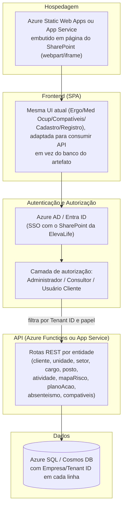

# BI Ergonomia — ElevaLife

Manual de uso, arquitetura e processo (BPMN) do produto **BI Ergonomia**, um
dashboard analítico web, standalone e independente de qualquer cliente,
desenvolvido pela ElevaLife recriando em tecnologia web a especificação do RD
"BI Ergonomia v1.0" (Power BI, W&SBI). Esta build usa **dados fictícios
realistas** — não há integração real com MedSafe/MS Ergo Profissional nem com
o Sistema de Gestão Integrada da ElevaLife nesta fase.

## Sumário

1. [Visão geral](#visão-geral)
2. [Como acessar e navegar](#como-acessar-e-navegar)
3. [Filtros globais x filtros de página](#filtros-globais-x-filtros-de-página)
4. [Dashboard "Ergo"](#dashboard-ergo)
5. [Dashboard "Med Ocup"](#dashboard-med-ocup)
6. [Dashboard "Compatíveis"](#dashboard-compatíveis)
7. [Cadastro (dados mestre) x Registro (lançamento operacional)](#cadastro-dados-mestre-x-registro-lançamento-operacional)
8. [Tabelas de referência](#tabelas-de-referência)
9. [Diagramas corporais — convenção anatômica](#diagramas-corporais--convenção-anatômica)
10. [Modelo de dados](#modelo-de-dados)
11. [Regras de cálculo](#regras-de-cálculo)
12. [Arquitetura em camadas](#arquitetura-em-camadas)
13. [BPMN — processo de gestão de ergonomia](#bpmn--processo-de-gestão-de-ergonomia)
14. [Cobertura dos indicadores do RD](#cobertura-dos-indicadores-do-rd)
15. [Escopo, limitações e próximos passos](#escopo-limitações-e-próximos-passos)
16. [Próxima fase: multi-tenant, RBAC e hospedagem Azure/SharePoint](#próxima-fase-multi-tenant-rbac-e-hospedagem-azuresharepoint)

---

## Visão geral

O BI Ergonomia reúne em um único painel web os três eixos de gestão de
ergonomia ocupacional:

- **Ergo** — mapa de risco por posto de trabalho e acompanhamento do plano de
  ação corretivo.
- **Med Ocup** — indicadores de absenteísmo e taxa de frequência de
  afastamentos, incluindo a distribuição de dias perdidos por região do corpo.
- **Compatíveis** — gestão de colaboradores com restrição médica e sua
  recolocação em atividades compatíveis.

O produto é **auto-contido**: roda inteiramente no navegador, sem backend
próprio. Os dados operacionais ficam persistidos no banco do próprio artefato
(ver [Arquitetura em camadas](#arquitetura-em-camadas)); as duas tabelas de
referência (Lista CID e Dias Úteis) são estáticas.

## Como acessar e navegar

A navegação fica em um **menu lateral retrátil** (padrão visual ElevaLife —
vinho em gradiente, mesmo estilo do Cockpit Comercial), fixo à esquerda da
tela enquanto o conteúdo rola:

- **Desktop**: o botão "Recolher menu" reduz o menu a um trilho só de
  ícones, ganhando espaço horizontal para os dashboards; a preferência
  (recolhido ou expandido) fica lembrada no navegador para a próxima visita.
- **Telas estreitas (celular/tablet)**: o menu vira uma gaveta deslizante,
  aberta pelo botão de menu (☰) no topo e fechada tocando fora dela ou
  escolhendo um item.

O menu tem 5 itens:

| Item do menu | Conteúdo |
| --- | --- |
| **Ergo** | 9 indicadores de risco e plano de ação (item inicial) |
| **Med Ocup** | 5 indicadores de absenteísmo e taxa de frequência |
| **Compatíveis** | 8 indicadores de restrição médica e recolocação |
| **Cadastro** | Setup dos dados mestre: Cliente, Unidade, Setor, Cargo, Posto de Trabalho, Atividade |
| **Registro** | Lançamento operacional: Mapa Risco, Plano Ação, Absenteísmo, Compatíveis |

No topo da área de conteúdo ficam os botões de exportação **PDF** e
**Excel** (ver abaixo), e o rodapé traz um link **"Ver tabelas de
referência"** que abre, por cima da tela atual, a consulta somente-leitura
de Lista CID e Dias Úteis (ver
[Tabelas de referência](#tabelas-de-referência)).

### Exportar relatório (PDF/Excel)

Os botões **PDF** e **Excel**, sempre visíveis no topo, exportam a **tela
atual**, respeitando os filtros globais (e de página, quando aplicável) já
selecionados:

- **PDF**: gera um relatório com os KPIs e os gráficos exatamente como estão
  na tela (inclui os diagramas corporais, quando presentes na aba).
- **Excel**: gera uma planilha com as linhas brutas filtradas por trás
  daquela tela (a tabela operacional correspondente à aba aberta).

## Filtros globais x filtros de página

- **Filtros globais** (barra fixa no topo, abaixo do cabeçalho): Ano/Mês,
  Cliente, Unidade, Setor, Posto de Trabalho, Cargo, Atividade. Valem para
  **todas as abas** simultaneamente e são cascateados — selecionar um Cliente
  restringe as opções de Unidade/Setor/etc. às combinações que realmente
  existem no Mapa de Risco.
- **Filtros de página** (só na aba Compatíveis, logo abaixo do cabeçalho da
  aba): Status Restrição e Turno de Trabalho. Valem só para os 8 indicadores
  daquela aba e são independentes dos filtros globais.

## Dashboard "Ergo"

9 indicadores, todos reagindo aos filtros globais:

1. Mapa de Risco Global (tiles por nível: Baixo/Médio/Alto/Muito Alto)
2. Top 3 Setores críticos (% de postos em risco Alto/Muito Alto)
3. Plano de Ação — Global (donut por Status Ação)
4. Plano de Ação — Postos Críticos (mesmo donut, restrito a Risco Global =
   Alto/Muito Alto)
5. Plano de Ação por Responsável (barra horizontal empilhada)
6. Ações previstas no período (linha, por Ano/Mês Programado)
7. Ações concluídas no período (linha, por Ano/Mês Concluída)
8. Mapa de Risco por Setor (barra horizontal empilhada por nível)
9. Status do Plano de Ação por Setor (barra horizontal empilhada por status)

## Dashboard "Med Ocup"

5 indicadores:

1. Cards de totais — Qtd Colaboradores, Qtd Dias Perdidos, Taxa de Frequência
2. Evolução da Taxa de Frequência (linha mensal; passe o mouse para ver, no
   mesmo tooltip, a Evolução de Atestados e a Evolução de Dias Perdidos)
3. Taxa de Frequência por Setor (barra)
4. Diagrama corporal — dias perdidos, vista **frontal**
5. Diagrama corporal — dias perdidos, vista **posterior** ("costas")

A Taxa de Frequência segue a metodologia padrão de SST/CIPA (NBR 14280):

```
HHT (Homens-Hora Trabalhados) = Σ (Qtd Colaboradores × Qtd Dias Úteis × 8h)
Taxa de Frequência = (nº de casos de afastamento / HHT) × 1.000.000
```

## Dashboard "Compatíveis"

8 indicadores, todos reagindo aos filtros globais **e** aos filtros de página
(Status Restrição, Turno de Trabalho):

1. Gênero (pizza)
2. Idade (barra vertical, 5 faixas etárias)
3. Status por Setor (barra horizontal empilhada por Status Restrição)
4. Restrição por Turno (barra horizontal empilhada por Status Restrição)
5. Diagrama corporal — restrições, vista **frontal**
6. Diagrama corporal — restrições, vista **posterior**
7. Em Atividade Compatível (pizza Sim/Não)
8. Compatível por Setor (barra horizontal, restrito a Atividade Compatível =
   "Sim")

## Cadastro (dados mestre) x Registro (lançamento operacional)

Seguindo o mesmo padrão do **Cockpit Comercial** (aba Cadastro daquele
produto), o antigo "Cadastros" foi desmembrado em duas abas com propósitos
diferentes — mas com a mesma mecânica de fundo: gravação real no banco do
artefato, visível para qualquer pessoa que abrir o mesmo link.

- **Cadastro** — tela de *setup*: cadastra a estrutura organizacional
  válida do cliente, em 6 sub-abas (uma por entidade): **Cliente**,
  **Unidade**, **Setor**, **Cargo**, **Posto de Trabalho** e **Atividade**.
  É o que precisa existir *antes* de qualquer lançamento operacional.
- **Registro** — tela de *lançamento* (antigo "Cadastros"): as 4 tabelas
  operacionais — Mapa Risco, Plano Ação, Absenteísmo e Compatíveis. É onde
  o dia a dia da operação registra um novo posto avaliado, uma ação, um
  afastamento ou uma restrição.

### Cadastro — dados mestre, fonte única de verdade

Cada sub-aba de Cadastro guarda só os campos até o próprio nível na cadeia
Cliente → Unidade → Setor → {Cargo, Posto de Trabalho → Atividade} — por
exemplo, um registro de Setor tem `Cliente`, `Unidade` e `Setor`; um
registro de Atividade tem os 5 campos até `Atividade`. Juntas, essas 6
coleções são a **fonte única de verdade**: os 6 campos-chave dos 4
formulários de Registro usam **seletores em cascata** validados contra o
Cadastro, em vez de campos de texto livre — isso evita lançar um posto,
cargo ou setor que não existe de fato na estrutura do cliente.

A cascata funciona assim: escolher um Cliente restringe as opções de
Unidade às unidades daquele cliente, e assim por diante. **Cargo** e
**Posto de Trabalho** são irmãos independentes dentro do mesmo Setor (não
existe hierarquia nem filtro mútuo entre os dois no cadastro mestre — a
combinação real dos dois só se forma no lançamento operacional); já
**Atividade** é filha de Posto de Trabalho.

O mesmo motor de cascata atende tanto os formulários de Cadastro (2 a 5
campos, conforme a entidade) quanto os de Registro (os 6 campos completos)
— um formulário com um subconjunto dos campos simplesmente ignora os
níveis que não tem.

### Registro — lançamento operacional

Comportamentos automáticos do formulário:

- **Mapa Risco**: o campo "Risco Global" é **calculado ao vivo** a partir da
  média das 12 dimensões de risco digitadas (nunca digitado à mão). O
  identificador do registro é gerado a partir da chave composta
  Cliente+Unidade+Setor+Posto+Cargo+Atividade — editar essa chave "renomeia"
  o registro internamente.
- **Plano Ação**: ao escolher a chave do posto, o Risco Global é
  **preenchido automaticamente por consulta ao Mapa Risco**; o campo "Fator
  Risco pós Ação" só é habilitado depois que "Dt Conclusão" é preenchida; a
  "Categoria Ação" é sugerida a partir da "Ação Recomendada" escolhida;
  "Status Ação" nunca é digitado — é sempre calculado (ver
  [Regras de cálculo](#regras-de-cálculo)).
- **Absenteísmo**: "Dt Retorno" é calculada automaticamente
  (Dt Afastamento + Qtd Dias); o "Cód CID" sugere a partir da Lista CID.

Se a capacidade de banco de dados não estiver disponível na visualização
atual (por exemplo, uma pré-visualização sem sessão), a aba entra em **modo
somente leitura**: mostra um aviso, desabilita os botões de novo/editar/
excluir e exibe os dados fictícios de exemplo no lugar dos dados reais.

## Tabelas de referência

Lista CID e Dias Úteis são tabelas **estáticas** (não fazem parte do CRUD) e
ficam ocultas do fluxo normal — acessíveis só pelo link "Ver tabelas de
referência" no rodapé, para consulta. Elas alimentam, respectivamente, o
lookup de CID Abrev. no Absenteísmo e a contagem de colaboradores/dias úteis
usada na Taxa de Frequência.

## Diagramas corporais — convenção anatômica

Os 4 diagramas (2 em Med Ocup, 2 em Compatíveis) usam uma silhueta humana
esquemática com caixas tracejadas conectadas por linha-guia a cada região,
gerados por uma **única função parametrizada** (`BI.Diagramas.renderizar`,
em `js/diagramas.js`) — nunca uma função por região.

Convenção adotada (pessoa olhando para o espectador na vista frontal, de
costas para o espectador na vista posterior):

- **Vista frontal**: o lado **Direito da pessoa** aparece à **esquerda da
  imagem** (como em uma foto de frente).
- **Vista posterior ("costas")**: o lado **Direito da pessoa** aparece à
  **direita da imagem**.

Regiões cobertas: Ombro, Cotovelo, Punho, Mão e Pé (D/E) na vista frontal;
Cervical, Dorsal, Lombar, Quadril, Joelho e Tornozelo (D/E onde aplicável) na
vista posterior — 19 regiões no total, as mesmas usadas tanto para "dias
perdidos" (Med Ocup) quanto para "contagem de restrições" (Compatíveis).

## Modelo de dados

O RD original é escrito em linguagem Power BI (tabelas, relacionamentos,
medidas DAX). Esta build **traduz a arquitetura**, e não copia o Power BI ao
pé da letra:

- As 6 tabelas do RD viram estruturas de dados (arrays de objetos) com os
  **mesmos campos**.
- A "Linktable" do RD (chave composta Cliente+Unidade+Setor+Posto+Cargo+
  Atividade[+Ano/Mês]) não existe como tabela à parte — é só a lógica de
  junção entre os arrays, implementada como funções puras de filtro/
  agregação (`Calc.filtrar`, `Calc.buscarPorChave`, `Calc.opcoesDeFiltro`).
- Os blocos de medidas repetidas por região corporal ("Dias perdido
  &lt;REGIÃO&gt;" e "Restrição &lt;REGIÃO&gt;") viram **uma função
  parametrizada por região** (`Calc.somaDiasPorRegiao`,
  `Calc.contagemPorRegiao`), não dezenas de funções quase idênticas.

### Cadastro mestre (6 coleções normalizadas)

Substituem a antiga tabela única "Hierarquia" (6 colunas, 1 linha por
combinação completa). Cada coleção guarda só os campos até o seu próprio
nível:

| Coleção | Campos |
| --- | --- |
| `cliente` | `Cliente` |
| `unidade` | `Cliente`, `Unidade` |
| `setor` | `Cliente`, `Unidade`, `Setor` |
| `cargo` | `Cliente`, `Unidade`, `Setor`, `Cargo` |
| `posto` | `Cliente`, `Unidade`, `Setor`, `Posto Trabalho` |
| `atividade` | `Cliente`, `Unidade`, `Setor`, `Posto Trabalho`, `Atividade` |

`Cargo` e `Posto Trabalho` são irmãos (ambos filhos de `Setor`, sem relação
entre si); `Atividade` é filha de `Posto Trabalho`. É a partir dessas 6
coleções que os seletores em cascata dos 4 formulários de Registro (e dos
próprios formulários de Cadastro) buscam as combinações válidas — ver
[Cadastro (dados mestre) x Registro (lançamento operacional)](#cadastro-dados-mestre-x-registro-lançamento-operacional).

### Lista CID (referência)

`Cód CID`, `CID`, `CID Abrev.`

### Dias Úteis (referência)

`Cliente`, `Unidade`, `Setor`, `Ano/Mês Úteis`, `Qtd Colaboradores`,
`Qtd Dias Úteis`

### Mapa Risco (operacional)

`Cliente`, `Unidade`, `Setor`, `Posto Trabalho`, `Cargo`, `Atividade`,
`Risco Global` (calculado), e as 12 dimensões de risco: Col. Cervical,
Tronco, Ombros, Cotovelos, Punhos, Mãos/Dedos, Joelhos, Pernas, Tornozelos,
Pés/Dedos, Psicossocial/Cognitivo, Ambiental.

### Plano Ação (operacional)

`Cliente`, `Unidade`, `Setor`, `Posto Trabalho`, `Cargo`, `Atividade`,
`Ação Recomendada`, `Gestão Ação`, `Status Ação` (calculado),
`Dt Programada`, `Dt Conclusão`, `Nr Ação`, `Categoria Ação`,
`Responsável Ação`, `E-mail Responsável`, `Auditoria Ergonomista`,
`Dt Auditoria`, `Fator Risco pós Ação`, `Medida Controle ADM`,
`Risco Global`

### Absenteísmo (operacional)

`Cliente`, `Unidade`, `Setor`, `Posto Trabalho`, `Cargo`, `Atividade`,
`Cód CID` (lookup em Lista CID → CID Abrev.), `Dt Afastamento`, `Qtd Dias`,
`Região Corporal`, `Dt Retorno` (calculado = Dt Afastamento + Qtd Dias)

### Compatíveis (operacional)

`Cliente`, `Unidade`, `Setor`, `Posto Trabalho`, `Cargo`, `Atividade`,
`Status Restrição`, `Matrícula`, `Funcionário`, `Turno Trabalho`, `Gênero`,
`Idade`, `Tempo Empresa`, `Responsável Área`, `Médico Avaliador`,
`Queixa Principal`, `Segmento Corporal`, `Restrição Médica`,
`Início/Fim Restrição`, `Histórico Restrição?`, `Doc Atividade Compatível`,
`Retorno Médico`, `Atividade Compatível (recomendada)`,
`Atividade Compatível?` (sim/não)

## Regras de cálculo

### Status Ação (Plano Ação)

Aplicada exatamente conforme o RD, sempre calculada — nunca digitada:

1. `Dt Programada = nulo` **e** `Dt Conclusão = nulo` → **Não Iniciado**
2. `Dt Conclusão = nulo` **e** `Dt Programada < hoje` → **Atrasada**
3. `Dt Programada <= hoje` **e** `Dt Conclusão = nulo` → **Em Andamento**
4. `Dt Conclusão > Dt Programada` → **Concluída com atraso**
5. (implícito) `Dt Conclusão` preenchida e `<= Dt Programada` → **Concluída**

### Risco Global (Mapa Risco)

Média das 12 dimensões de risco (nunca o máximo):

- média ≥ 2,7 → **Muito Alto**
- média ≥ 2,15 → **Alto**
- média ≥ 1,55 → **Médio**
- caso contrário → **Baixo**

### Taxa de Frequência (Med Ocup)

Ver [Dashboard "Med Ocup"](#dashboard-med-ocup) acima (metodologia NBR 14280).

## Arquitetura em camadas

```mermaid
flowchart TB
    subgraph Dados["Camada de Dados"]
        Mock["data/mock_data.json\n(Lista CID + Dias Úteis, estáticas\n+ dados fictícios iniciais)"]
        DB["Banco do artefato (capacidade \"db\")\nCliente · Unidade · Setor · Cargo · Posto · Atividade\n(cadastro mestre) + Mapa Risco · Plano Ação\nAbsenteísmo · Compatíveis (registro)"]
    end
    subgraph Calculo["Camada de Cálculo — js/calc.js"]
        Funcoes["Funções puras:\nfiltrar · buscarPorChave · opcoesDeFiltro\ncalcularStatusAcao · calcularRiscoGlobal\ncalcularTaxaFrequencia · somaDiasPorRegiao\ncontagemPorRegiao · ..."]
    end
    subgraph Diagramas["Camada de Diagramas — js/diagramas.js"]
        SVG["Silhueta SVG parametrizada\n(frente/costas + mapa região→valor)"]
    end
    subgraph Apresentacao["Camada de Apresentação — js/app.js"]
        Menu["Menu lateral retrátil\n(navegação + exportar PDF/Excel)"]
        Filtros["Filtros globais e de página"]
        Graficos["Gráficos (Chart.js) e tiles"]
        CRUD["Cadastro (setup mestre) e\nRegistro (lançamento operacional)\ncom cascata validada pelo cadastro mestre"]
    end

    Mock -->|carga inicial| Funcoes
    DB -->|onSnapshot em tempo real| Funcoes
    Funcoes --> Graficos
    Funcoes --> SVG
    SVG --> Graficos
    Filtros --> Funcoes
    CRUD -->|salvar/excluir| DB
```

Princípio de separação: trocar o mock/DB fictício por integração real com
MedSafe ou o Sistema de Gestão Integrada da ElevaLife no futuro não deve
exigir tocar em `calc.js` nem em `app.js`, desde que a forma das linhas
(mesmos campos e chaves) seja preservada.

## BPMN — processo de gestão de ergonomia

Fluxo de uso ponta a ponta que o BI Ergonomia apoia, do mapeamento de risco
até a recolocação do colaborador:


## Cobertura dos indicadores do RD

O RD original especifica 49 medidas DAX. Como registrado na tradução de
arquitetura, a maioria dessas medidas é a **mesma fórmula repetida por
região corporal** — 19 regiões × 2 blocos ("Dias perdido &lt;REGIÃO&gt;" e
"Restrição &lt;REGIÃO&gt;") = 38 medidas, cobertas aqui por 2 funções
parametrizadas (`Calc.somaDiasPorRegiao` e `Calc.contagemPorRegiao`) em vez
de 38 funções quase idênticas. As 11 medidas restantes correspondem aos
demais KPIs visíveis, todos com equivalente implementado:

| Dashboard | Indicadores (RD) | Implementado |
| --- | --- | --- |
| Ergo | 9 | ✅ 9/9 |
| Med Ocup | 5 (incluindo os 2 diagramas) | ✅ 5/5 |
| Compatíveis | 8 (incluindo os 2 diagramas) | ✅ 8/8 |
| **Total de indicadores visuais** | **22** | **✅ 22/22** |
| Medidas região-a-região (Dias perdido + Restrição) | 38 | ✅ cobertas por 2 funções parametrizadas |

O dado final bate com o RD (mesmos campos, mesmas regras de cálculo, mesma
segmentação por região corporal), ainda que a implementação não seja
função-a-função — exatamente como orientado.

## Escopo, limitações e próximos passos

- **Fora de escopo nesta fase**: integração real com MedSafe/MS Ergo
  Profissional ou com o Sistema de Gestão Integrada da ElevaLife. Todos os
  dados de exemplo são fictícios.
- **Persistência**: os cadastros reais (Cliente, Unidade, Setor, Cargo,
  Posto de Trabalho, Atividade, Mapa Risco, Plano Ação, Absenteísmo,
  Compatíveis) usam o banco de dados do próprio artefato publicado — não há
  backend externo. Qualquer pessoa com o link e sessão ElevaLife pode ler e
  gravar; hoje não há isolamento entre empresas nem controle de acesso por
  papel (ver próxima seção).
- **Próxima fase (fora deste build)**: este produto está desenhado para
  depois virar a gestão de indicadores real do projeto, trocando a camada de
  dados fictícios por integração com as fontes reais, sem precisar reescrever
  as camadas de cálculo, diagramas ou apresentação. Essa próxima fase inclui
  multi-tenant, hierarquia de acesso (RBAC) e hospedagem nativa no
  SharePoint da ElevaLife via Azure — ver
  [Próxima fase: multi-tenant, RBAC e hospedagem Azure/SharePoint](#próxima-fase-multi-tenant-rbac-e-hospedagem-azuresharepoint).

## Próxima fase: multi-tenant, RBAC e hospedagem Azure/SharePoint

Esta seção documenta o **plano** para a fase seguinte, combinada com Léo em
15/09/2026 ("Cadastro agora, migração depois"): a reestruturação do
Cadastro/Registro deste documento já está implementada e publicada; o que
segue é arquitetura para implementar depois, ainda não construída.

### Por que uma nova fase

O Cowork Artifact atual roda inteiramente no navegador, com um banco de
dados compartilhado por artefato e sem autenticação própria — qualquer
pessoa com o link e uma sessão Claude/ElevaLife lê e grava os mesmos dados.
Isso é suficiente para validar o produto com dados fictícios, mas não
atende três requisitos que Léo colocou para a versão em produção:

1. **Multi-tenant real** — várias empresas-cliente usando a mesma
   plataforma, sem uma enxergar os dados da outra.
2. **Hierarquia de acesso (RBAC)** — três papéis com visibilidade
   diferente: **Administrador** (vê tudo), **Consultor** (vê só as empresas
   às quais está vinculado) e **Usuário do cliente** (vê só a própria
   empresa).
3. **Hospedagem nativa no SharePoint da ElevaLife**, via Azure — em vez de
   um link avulso do Cowork.

Nenhum desses três pontos é alcançável dentro do modelo de artefato do
Cowork (que não tem login próprio nem isolamento por linha) — por isso a
recomendação é migrar para uma aplicação hospedada de verdade.

### Arquitetura proposta



Pontos-chave do desenho:

- **Isolamento por tenant**: cada linha de cada coleção/tabela ganha um
  campo `EmpresaId` (ou `TenantId`); toda consulta da API é filtrada por
  esse campo antes de qualquer outro filtro de negócio — nunca confiar em
  filtro só no frontend.
- **RBAC em 3 níveis**, resolvido no login via Azure AD/Entra ID:
  - **Administrador**: sem filtro de `EmpresaId` — vê e edita tudo.
  - **Consultor**: filtro por uma lista de `EmpresaId` vinculados a ele
    (tabela de associação Consultor↔Empresa).
  - **Usuário do cliente**: filtro fixo no `EmpresaId` da própria empresa,
    sem opção de trocar.
- **Hospedagem no SharePoint via Azure**: a opção mais direta é publicar o
  frontend como **Azure Static Web App** (ou App Service) e embutir a
  página dentro de um site do SharePoint da ElevaLife via webpart de
  conteúdo embutido (App/iframe), com SSO compartilhado pelo mesmo Azure
  AD/Entra ID que autentica o SharePoint — assim o usuário não faz um
  segundo login.
- O desktop de Léo já tem o **Azure MCP Server** configurado localmente,
  o que facilita provisionar os recursos (Static Web App, Function App,
  banco de dados, Azure AD App Registration) diretamente por ali quando
  esta fase começar.

### Passo a passo para publicar (GitHub + Azure + SharePoint)

1. **GitHub**: criar o repositório `ComercialElevaLife/elevalife-ergonomia`
   (ou nome equivalente) e enviar o código atual deste repositório local
   (`/home/claude/bi-ergonomia`) como commit inicial. *Nota:* uma tentativa
   anterior de publicar direto pelo Cowork foi bloqueada pela política de
   rede do sandbox; o código foi então entregue a Léo como arquivo `.tar.gz`
   para ele subir manualmente — esse é o caminho a repetir aqui, ou repetir
   a tentativa de push direto quando a rede permitir.
2. **Registrar a aplicação no Azure AD/Entra ID** da ElevaLife (App
   Registration), habilitando login single-tenant (só usuários/domínios da
   ElevaLife e das empresas-cliente autorizadas).
3. **Provisionar o banco de dados** (Azure SQL Database ou Cosmos DB) com
   as 10 tabelas/coleções atuais, cada uma com a coluna `EmpresaId`
   adicionada, e uma tabela adicional de associação Consultor↔Empresa.
4. **Provisionar a API** (Azure Functions, plano de consumo para começar)
   com uma rota por entidade, validando o token do Azure AD e aplicando o
   filtro de `EmpresaId`/papel em toda consulta.
5. **Publicar o frontend** como Azure Static Web App, conectado ao
   repositório do GitHub (deploy automático a cada push na branch
   principal) — o Static Web Apps já integra com Azure AD nativamente.
6. **Embutir no SharePoint**: no site do SharePoint da ElevaLife, adicionar
   a página como conteúdo embutido (webpart "Embed" apontando para a URL
   do Static Web App, ou um App Part registrado no catálogo de Apps do
   SharePoint) — com o mesmo tenant Azure AD, o SSO é automático.
7. **Migrar os dados fictícios atuais** (ou os primeiros dados reais) para
   o novo banco, associando cada linha ao `EmpresaId` correto.
8. **Cadastrar os primeiros usuários e papéis** (Administrador, Consultor,
   Usuário do cliente) e testar o isolamento entre pelo menos 2 empresas
   fictícias antes de liberar para uso real.

Este plano ainda não foi executado — fica registrado aqui para a próxima
fase, conforme combinado com Léo.
