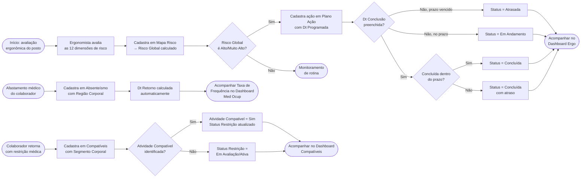
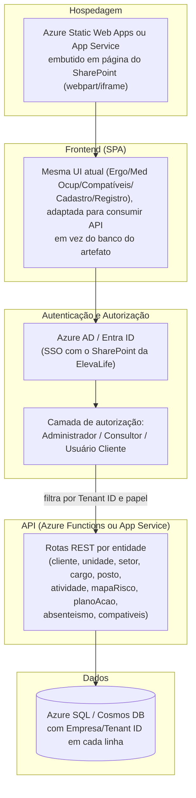
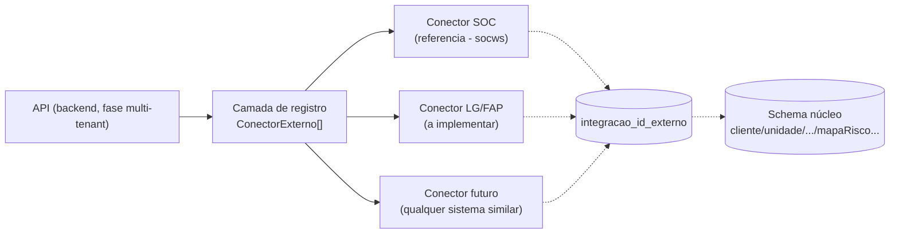
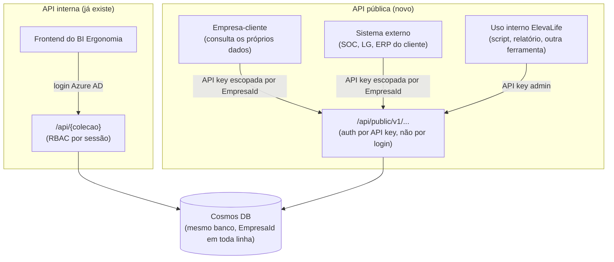

# BI Ergonomia — ElevaLife

Manual de uso, arquitetura e processo (BPMN) do produto **BI Ergonomia**, um
dashboard analítico web, standalone e independente de qualquer cliente,
desenvolvido pela ElevaLife recriando em tecnologia web a especificação do RD
"BI Ergonomia v1.0" (Power BI, W&SBI). Esta build usa **dados fictícios
realistas** — não há integração real com MedSafe/MS Ergo Profissional nem com
o Sistema de Gestão Integrada da ElevaLife nesta fase.

## Sumário

1. [Visão geral](#visão-geral)
2. [Como acessar e navegar](#como-acessar-e-navegar)
3. [Filtros globais x filtros de página](#filtros-globais-x-filtros-de-página)
4. [Dashboard "Ergo"](#dashboard-ergo)
5. [Dashboard "Med Ocup"](#dashboard-med-ocup)
6. [Dashboard "Compatíveis"](#dashboard-compatíveis)
7. [Cadastro (dados mestre) x Registro (lançamento operacional)](#cadastro-dados-mestre-x-registro-lançamento-operacional)
8. [Tabelas de referência](#tabelas-de-referência)
9. [Diagramas corporais — convenção anatômica](#diagramas-corporais--convenção-anatômica)
10. [Modelo de dados](#modelo-de-dados)
11. [Regras de cálculo](#regras-de-cálculo)
12. [Arquitetura em camadas](#arquitetura-em-camadas)
13. [BPMN — processo de gestão de ergonomia](#bpmn--processo-de-gestão-de-ergonomia)
14. [Cobertura dos indicadores do RD](#cobertura-dos-indicadores-do-rd)
15. [Escopo, limitações e próximos passos](#escopo-limitações-e-próximos-passos)
16. [Backlog combinado com Léo (ainda não implementado)](#backlog-combinado-com-léo-ainda-não-implementado)
17. [Próxima fase: multi-tenant, RBAC e hospedagem Azure/SharePoint](#próxima-fase-multi-tenant-rbac-e-hospedagem-azuresharepoint)
18. [Integração com sistemas externos (SOC, LG/FAP e outros)](#integração-com-sistemas-externos-soc-lgfap-e-outros)
19. [Reprodução do Sistema de Gestão Integrada como módulos do BI Ergonomia](#reprodução-do-sistema-de-gestão-integrada-como-módulos-do-bi-ergonomia)

---

## Visão geral

O BI Ergonomia reúne em um único painel web os três eixos de gestão de
ergonomia ocupacional:

- **Ergo** — mapa de risco por posto de trabalho e acompanhamento do plano de
  ação corretivo.
- **Med Ocup** — indicadores de absenteísmo e taxa de frequência de
  afastamentos, incluindo a distribuição de dias perdidos por região do corpo.
- **Compatíveis** — gestão de colaboradores com restrição médica e sua
  recolocação em atividades compatíveis.

O produto é **auto-contido**: roda inteiramente no navegador, sem backend
próprio. Os dados operacionais ficam persistidos no banco do próprio artefato
(ver [Arquitetura em camadas](#arquitetura-em-camadas)); as duas tabelas de
referência (Lista CID e Dias Úteis) são estáticas.

## Como acessar e navegar

A navegação fica em um **menu lateral retrátil** (padrão visual ElevaLife —
vinho em gradiente, mesmo estilo do Cockpit Comercial), fixo à esquerda da
tela enquanto o conteúdo rola:

- **Desktop**: o botão "Recolher menu" reduz o menu a um trilho só de
  ícones, ganhando espaço horizontal para os dashboards; a preferência
  (recolhido ou expandido) fica lembrada no navegador para a próxima visita.
- **Telas estreitas (celular/tablet)**: o menu vira uma gaveta deslizante,
  aberta pelo botão de menu (☰) no topo e fechada tocando fora dela ou
  escolhendo um item.

O menu tem 5 itens:

| Item do menu | Conteúdo |
| --- | --- |
| **Ergo** | 9 indicadores de risco e plano de ação (item inicial) |
| **Med Ocup** | 5 indicadores de absenteísmo e taxa de frequência |
| **Compatíveis** | 8 indicadores de restrição médica e recolocação |
| **Cadastro** | Setup dos dados mestre: Cliente, Unidade, Setor, Cargo, Posto de Trabalho, Atividade |
| **Registro** | Lançamento operacional: Mapa Risco, Plano Ação, Absenteísmo, Compatíveis |

**Cadastro** e **Registro** são itens em **árvore retrátil** (mesmo padrão
do menu do Cockpit Comercial): um clique abre, dentro do próprio menu
lateral, a lista das 6 entidades (Cadastro) ou das 4 tabelas (Registro) por
baixo deles; clicar direto num sub-item já leva para aquela entidade/tabela
específica. Só uma árvore fica aberta por vez, e clicar de novo no item já
ativo apenas recolhe/expande a árvore, sem trocar de tela. Em telas
estreitas essa árvore não é necessária — a mesma navegação já existe como
pílulas fixas dentro da própria página de Cadastro/Registro.

No topo da área de conteúdo fica a barra de ações, no mesmo padrão de ícones
do Cockpit Comercial:

- **Filtros** (ícone de funil): recolhe/expande a barra de filtros globais,
  liberando espaço de tela sem perder a seleção feita.
- **Atualizar** (ícone circular): re-renderiza os KPIs, gráficos e tabelas
  com os dados e filtros atuais, sem recarregar a página.
- **PDF** / **Excel** (ver abaixo).

O rodapé traz um link **"Ver tabelas de referência"** que abre, por cima da
tela atual, a consulta somente-leitura de Lista CID e Dias Úteis (ver
[Tabelas de referência](#tabelas-de-referência)).

### Exportar relatório (PDF/Excel)

Os botões **PDF** e **Excel**, sempre visíveis no topo, exportam a **tela
atual**, respeitando os filtros globais (e de página, quando aplicável) já
selecionados:

- **PDF**: gera um relatório com os KPIs e os gráficos exatamente como estão
  na tela (inclui os diagramas corporais, quando presentes na aba).
- **Excel**: gera uma planilha com as linhas brutas filtradas por trás
  daquela tela (a tabela operacional correspondente à aba aberta).

## Filtros globais x filtros de página

- **Filtros globais** (barra fixa no topo, abaixo do cabeçalho): Ano/Mês,
  Cliente, Unidade, Setor, Posto de Trabalho, Cargo, Atividade. Valem para
  **todas as abas** simultaneamente e são cascateados — selecionar um Cliente
  restringe as opções de Unidade/Setor/etc. às combinações que realmente
  existem no Mapa de Risco.
- **Filtros de página** (só na aba Compatíveis, logo abaixo do cabeçalho da
  aba): Status Restrição e Turno de Trabalho. Valem só para os 8 indicadores
  daquela aba e são independentes dos filtros globais.

## Dashboard "Ergo"

9 indicadores, todos reagindo aos filtros globais:

1. Mapa de Risco Global (tiles por nível: Baixo/Médio/Alto/Muito Alto)
2. Top 3 Setores críticos (% de postos em risco Alto/Muito Alto)
3. Plano de Ação — Global (donut por Status Ação)
4. Plano de Ação — Postos Críticos (mesmo donut, restrito a Risco Global =
   Alto/Muito Alto)
5. Plano de Ação por Responsável (barra horizontal empilhada)
6. Ações previstas no período (linha, por Ano/Mês Programado)
7. Ações concluídas no período (linha, por Ano/Mês Concluída)
8. Mapa de Risco por Setor (barra horizontal empilhada por nível)
9. Status do Plano de Ação por Setor (barra horizontal empilhada por status)

## Dashboard "Med Ocup"

5 indicadores:

1. Cards de totais — Qtd Colaboradores, Qtd Dias Perdidos, Taxa de Frequência
2. Evolução da Taxa de Frequência (linha mensal; passe o mouse para ver, no
   mesmo tooltip, a Evolução de Atestados e a Evolução de Dias Perdidos)
3. Taxa de Frequência por Setor (barra)
4. Diagrama corporal — dias perdidos, vista **frontal**
5. Diagrama corporal — dias perdidos, vista **posterior** ("costas")

A Taxa de Frequência segue a metodologia padrão de SST/CIPA (NBR 14280):

```
HHT (Homens-Hora Trabalhados) = Σ (Qtd Colaboradores × Qtd Dias Úteis × 8h)
Taxa de Frequência = (nº de casos de afastamento / HHT) × 1.000.000
```

## Dashboard "Compatíveis"

8 indicadores, todos reagindo aos filtros globais **e** aos filtros de página
(Status Restrição, Turno de Trabalho):

1. Gênero (pizza)
2. Idade (barra vertical, 5 faixas etárias)
3. Status por Setor (barra horizontal empilhada por Status Restrição)
4. Restrição por Turno (barra horizontal empilhada por Status Restrição)
5. Diagrama corporal — restrições, vista **frontal**
6. Diagrama corporal — restrições, vista **posterior**
7. Em Atividade Compatível (pizza Sim/Não)
8. Compatível por Setor (barra horizontal, restrito a Atividade Compatível =
   "Sim")

## Cadastro (dados mestre) x Registro (lançamento operacional)

Seguindo o mesmo padrão do **Cockpit Comercial** (aba Cadastro daquele
produto), o antigo "Cadastros" foi desmembrado em duas abas com propósitos
diferentes — mas com a mesma mecânica de fundo: gravação real no banco do
artefato, visível para qualquer pessoa que abrir o mesmo link.

- **Cadastro** — tela de *setup*: cadastra a estrutura organizacional
  válida do cliente, em 6 sub-abas (uma por entidade): **Cliente**,
  **Unidade**, **Setor**, **Cargo**, **Posto de Trabalho** e **Atividade**.
  É o que precisa existir *antes* de qualquer lançamento operacional.
- **Registro** — tela de *lançamento* (antigo "Cadastros"): as 4 tabelas
  operacionais — Mapa Risco, Plano Ação, Absenteísmo e Compatíveis. É onde
  o dia a dia da operação registra um novo posto avaliado, uma ação, um
  afastamento ou uma restrição.

### Cadastro — dados mestre, fonte única de verdade

Cada sub-aba de Cadastro guarda só os campos até o próprio nível na cadeia
Cliente → Unidade → Setor → {Cargo, Posto de Trabalho → Atividade} — por
exemplo, um registro de Setor tem `Cliente`, `Unidade` e `Setor`; um
registro de Atividade tem os 5 campos até `Atividade`. Juntas, essas 6
coleções são a **fonte única de verdade**: os 6 campos-chave dos 4
formulários de Registro usam **seletores em cascata** validados contra o
Cadastro, em vez de campos de texto livre — isso evita lançar um posto,
cargo ou setor que não existe de fato na estrutura do cliente.

A cascata funciona assim: escolher um Cliente restringe as opções de
Unidade às unidades daquele cliente, e assim por diante. **Cargo** e
**Posto de Trabalho** são irmãos independentes dentro do mesmo Setor (não
existe hierarquia nem filtro mútuo entre os dois no cadastro mestre — a
combinação real dos dois só se forma no lançamento operacional); já
**Atividade** é filha de Posto de Trabalho.

O mesmo motor de cascata atende tanto os formulários de Cadastro (2 a 5
campos, conforme a entidade) quanto os de Registro (os 6 campos completos)
— um formulário com um subconjunto dos campos simplesmente ignora os
níveis que não tem.

### Registro — lançamento operacional

Comportamentos automáticos do formulário:

- **Mapa Risco**: o campo "Risco Global" é **calculado ao vivo** a partir da
  média das 12 dimensões de risco digitadas (nunca digitado à mão). O
  identificador do registro é gerado a partir da chave composta
  Cliente+Unidade+Setor+Posto+Cargo+Atividade — editar essa chave "renomeia"
  o registro internamente.
- **Plano Ação**: ao escolher a chave do posto, o Risco Global é
  **preenchido automaticamente por consulta ao Mapa Risco**; o campo "Fator
  Risco pós Ação" só é habilitado depois que "Dt Conclusão" é preenchida; a
  "Categoria Ação" é sugerida a partir da "Ação Recomendada" escolhida;
  "Status Ação" nunca é digitado — é sempre calculado (ver
  [Regras de cálculo](#regras-de-cálculo)).
- **Absenteísmo**: "Dt Retorno" é calculada automaticamente
  (Dt Afastamento + Qtd Dias); o "Cód CID" sugere a partir da Lista CID.

Se a capacidade de banco de dados não estiver disponível na visualização
atual (por exemplo, uma pré-visualização sem sessão), a aba entra em **modo
somente leitura**: mostra um aviso, desabilita os botões de novo/editar/
excluir e exibe os dados fictícios de exemplo no lugar dos dados reais.

## Tabelas de referência

Lista CID e Dias Úteis são tabelas **estáticas** (não fazem parte do CRUD) e
ficam ocultas do fluxo normal — acessíveis só pelo link "Ver tabelas de
referência" no rodapé, para consulta. Elas alimentam, respectivamente, o
lookup de CID Abrev. no Absenteísmo e a contagem de colaboradores/dias úteis
usada na Taxa de Frequência.

## Diagramas corporais — convenção anatômica

Os 4 diagramas (2 em Med Ocup, 2 em Compatíveis) usam uma silhueta humana
esquemática com caixas tracejadas conectadas por linha-guia a cada região,
gerados por uma **única função parametrizada** (`BI.Diagramas.renderizar`,
em `js/diagramas.js`) — nunca uma função por região.

Convenção adotada (pessoa olhando para o espectador na vista frontal, de
costas para o espectador na vista posterior):

- **Vista frontal**: o lado **Direito da pessoa** aparece à **esquerda da
  imagem** (como em uma foto de frente).
- **Vista posterior ("costas")**: o lado **Direito da pessoa** aparece à
  **direita da imagem**.

Regiões cobertas: Ombro, Cotovelo, Punho, Mão e Pé (D/E) na vista frontal;
Cervical, Dorsal, Lombar, Quadril, Joelho e Tornozelo (D/E onde aplicável) na
vista posterior — 19 regiões no total, as mesmas usadas tanto para "dias
perdidos" (Med Ocup) quanto para "contagem de restrições" (Compatíveis).

## Modelo de dados

O RD original é escrito em linguagem Power BI (tabelas, relacionamentos,
medidas DAX). Esta build **traduz a arquitetura**, e não copia o Power BI ao
pé da letra:

- As 6 tabelas do RD viram estruturas de dados (arrays de objetos) com os
  **mesmos campos**.
- A "Linktable" do RD (chave composta Cliente+Unidade+Setor+Posto+Cargo+
  Atividade[+Ano/Mês]) não existe como tabela à parte — é só a lógica de
  junção entre os arrays, implementada como funções puras de filtro/
  agregação (`Calc.filtrar`, `Calc.buscarPorChave`, `Calc.opcoesDeFiltro`).
- Os blocos de medidas repetidas por região corporal ("Dias perdido
  &lt;REGIÃO&gt;" e "Restrição &lt;REGIÃO&gt;") viram **uma função
  parametrizada por região** (`Calc.somaDiasPorRegiao`,
  `Calc.contagemPorRegiao`), não dezenas de funções quase idênticas.

### Cadastro mestre (6 coleções normalizadas)

Substituem a antiga tabela única "Hierarquia" (6 colunas, 1 linha por
combinação completa). Cada coleção guarda só os campos até o seu próprio
nível:

| Coleção | Campos |
| --- | --- |
| `cliente` | `Cliente` |
| `unidade` | `Cliente`, `Unidade` |
| `setor` | `Cliente`, `Unidade`, `Setor` |
| `cargo` | `Cliente`, `Unidade`, `Setor`, `Cargo` |
| `posto` | `Cliente`, `Unidade`, `Setor`, `Posto Trabalho` |
| `atividade` | `Cliente`, `Unidade`, `Setor`, `Posto Trabalho`, `Atividade` |

`Cargo` e `Posto Trabalho` são irmãos (ambos filhos de `Setor`, sem relação
entre si); `Atividade` é filha de `Posto Trabalho`. É a partir dessas 6
coleções que os seletores em cascata dos 4 formulários de Registro (e dos
próprios formulários de Cadastro) buscam as combinações válidas — ver
[Cadastro (dados mestre) x Registro (lançamento operacional)](#cadastro-dados-mestre-x-registro-lançamento-operacional).

### Lista CID (referência)

`Cód CID`, `CID`, `CID Abrev.`

### Dias Úteis (referência)

`Cliente`, `Unidade`, `Setor`, `Ano/Mês Úteis`, `Qtd Colaboradores`,
`Qtd Dias Úteis`

### Mapa Risco (operacional)

`Cliente`, `Unidade`, `Setor`, `Posto Trabalho`, `Cargo`, `Atividade`,
`Risco Global` (calculado), e as 12 dimensões de risco: Col. Cervical,
Tronco, Ombros, Cotovelos, Punhos, Mãos/Dedos, Joelhos, Pernas, Tornozelos,
Pés/Dedos, Psicossocial/Cognitivo, Ambiental.

### Plano Ação (operacional)

`Cliente`, `Unidade`, `Setor`, `Posto Trabalho`, `Cargo`, `Atividade`,
`Ação Recomendada`, `Gestão Ação`, `Status Ação` (calculado),
`Dt Programada`, `Dt Conclusão`, `Nr Ação`, `Categoria Ação`,
`Responsável Ação`, `E-mail Responsável`, `Auditoria Ergonomista`,
`Dt Auditoria`, `Fator Risco pós Ação`, `Medida Controle ADM`,
`Risco Global`

### Absenteísmo (operacional)

`Cliente`, `Unidade`, `Setor`, `Posto Trabalho`, `Cargo`, `Atividade`,
`Cód CID` (lookup em Lista CID → CID Abrev.), `Dt Afastamento`, `Qtd Dias`,
`Região Corporal`, `Dt Retorno` (calculado = Dt Afastamento + Qtd Dias)

### Compatíveis (operacional)

`Cliente`, `Unidade`, `Setor`, `Posto Trabalho`, `Cargo`, `Atividade`,
`Status Restrição`, `Matrícula`, `Funcionário`, `Turno Trabalho`, `Gênero`,
`Idade`, `Tempo Empresa`, `Responsável Área`, `Médico Avaliador`,
`Queixa Principal`, `Segmento Corporal`, `Restrição Médica`,
`Início/Fim Restrição`, `Histórico Restrição?`, `Doc Atividade Compatível`,
`Retorno Médico`, `Atividade Compatível (recomendada)`,
`Atividade Compatível?` (sim/não)

## Regras de cálculo

### Status Ação (Plano Ação)

Aplicada exatamente conforme o RD, sempre calculada — nunca digitada:

1. `Dt Programada = nulo` **e** `Dt Conclusão = nulo` → **Não Iniciado**
2. `Dt Conclusão = nulo` **e** `Dt Programada < hoje` → **Atrasada**
3. `Dt Programada <= hoje` **e** `Dt Conclusão = nulo` → **Em Andamento**
4. `Dt Conclusão > Dt Programada` → **Concluída com atraso**
5. (implícito) `Dt Conclusão` preenchida e `<= Dt Programada` → **Concluída**

### Risco Global (Mapa Risco)

Média das 12 dimensões de risco (nunca o máximo):

- média ≥ 2,7 → **Muito Alto**
- média ≥ 2,15 → **Alto**
- média ≥ 1,55 → **Médio**
- caso contrário → **Baixo**

### Taxa de Frequência (Med Ocup)

Ver [Dashboard "Med Ocup"](#dashboard-med-ocup) acima (metodologia NBR 14280).

## Arquitetura em camadas

```mermaid
flowchart TB
    subgraph Dados["Camada de Dados"]
        Mock["data/mock_data.json\n(Lista CID + Dias Úteis, estáticas\n+ dados fictícios iniciais)"]
        DB["Banco do artefato (capacidade \"db\")\nCliente · Unidade · Setor · Cargo · Posto · Atividade\n(cadastro mestre) + Mapa Risco · Plano Ação\nAbsenteísmo · Compatíveis (registro)"]
    end
    subgraph Calculo["Camada de Cálculo — js/calc.js"]
        Funcoes["Funções puras:\nfiltrar · buscarPorChave · opcoesDeFiltro\ncalcularStatusAcao · calcularRiscoGlobal\ncalcularTaxaFrequencia · somaDiasPorRegiao\ncontagemPorRegiao · ..."]
    end
    subgraph Diagramas["Camada de Diagramas — js/diagramas.js"]
        SVG["Silhueta SVG parametrizada\n(frente/costas + mapa região→valor)"]
    end
    subgraph Apresentacao["Camada de Apresentação — js/app.js"]
        Menu["Menu lateral retrátil\n(navegação + exportar PDF/Excel)"]
        Filtros["Filtros globais e de página"]
        Graficos["Gráficos (Chart.js) e tiles"]
        CRUD["Cadastro (setup mestre) e\nRegistro (lançamento operacional)\ncom cascata validada pelo cadastro mestre"]
    end

    Mock -->|carga inicial| Funcoes
    DB -->|onSnapshot em tempo real| Funcoes
    Funcoes --> Graficos
    Funcoes --> SVG
    SVG --> Graficos
    Filtros --> Funcoes
    CRUD -->|salvar/excluir| DB
```

Princípio de separação: trocar o mock/DB fictício por integração real com
MedSafe ou o Sistema de Gestão Integrada da ElevaLife no futuro não deve
exigir tocar em `calc.js` nem em `app.js`, desde que a forma das linhas
(mesmos campos e chaves) seja preservada.

## BPMN — processo de gestão de ergonomia

Fluxo de uso ponta a ponta que o BI Ergonomia apoia, do mapeamento de risco
até a recolocação do colaborador:


```mermaid
flowchart LR
    A([Início: avaliação\nergonômica do posto]) --> B[Ergonomista avalia\nas 12 dimensões de risco]
    B --> C[Cadastra em Mapa Risco\n→ Risco Global calculado]
    C --> D{Risco Global\né Alto/Muito Alto?}
    D -- Sim --> E[Cadastra ação em Plano Ação\ncom Dt Programada]
    D -- Não --> Z1([Monitoramento\nde rotina])
    E --> F{Dt Conclusão\npreenchida?}
    F -- "Não, prazo vencido" --> G[Status = Atrasada]
    F -- "Não, no prazo" --> H[Status = Em Andamento]
    F -- Sim --> I{Concluída dentro\ndo prazo?}
    I -- Sim --> J[Status = Concluída]
    I -- Não --> K[Status = Concluída\ncom atraso]
    G --> L([Acompanhar no\nDashboard Ergo])
    H --> L
    J --> L
    K --> L

    M([Afastamento médico\ndo colaborador]) --> N[Cadastra em Absenteísmo\ncom Região Corporal]
    N --> O[Dt Retorno calculada\nautomaticamente]
    O --> P([Acompanhar Taxa de\nFrequência no Dashboard\nMed Ocup])

    Q([Colaborador retorna\ncom restrição médica]) --> R[Cadastra em Compatíveis\ncom Segmento Corporal]
    R --> S{Atividade Compatível\nidentificada?}
    S -- Sim --> T[Atividade Compativel = Sim\nStatus Restrição atualizado]
    S -- Não --> U[Status Restrição =\nEm Avaliação/Ativa]
    T --> V([Acompanhar no Dashboard\nCompatíveis])
    U --> V
```

## Cobertura dos indicadores do RD

O RD original especifica 49 medidas DAX. Como registrado na tradução de
arquitetura, a maioria dessas medidas é a **mesma fórmula repetida por
região corporal** — 19 regiões × 2 blocos ("Dias perdido &lt;REGIÃO&gt;" e
"Restrição &lt;REGIÃO&gt;") = 38 medidas, cobertas aqui por 2 funções
parametrizadas (`Calc.somaDiasPorRegiao` e `Calc.contagemPorRegiao`) em vez
de 38 funções quase idênticas. As 11 medidas restantes correspondem aos
demais KPIs visíveis, todos com equivalente implementado:

| Dashboard | Indicadores (RD) | Implementado |
| --- | --- | --- |
| Ergo | 9 | ✅ 9/9 |
| Med Ocup | 5 (incluindo os 2 diagramas) | ✅ 5/5 |
| Compatíveis | 8 (incluindo os 2 diagramas) | ✅ 8/8 |
| **Total de indicadores visuais** | **22** | **✅ 22/22** |
| Medidas região-a-região (Dias perdido + Restrição) | 38 | ✅ cobertas por 2 funções parametrizadas |

O dado final bate com o RD (mesmos campos, mesmas regras de cálculo, mesma
segmentação por região corporal), ainda que a implementação não seja
função-a-função — exatamente como orientado.

## Escopo, limitações e próximos passos

- **Fora de escopo nesta fase**: integração real com MedSafe/MS Ergo
  Profissional ou com o Sistema de Gestão Integrada da ElevaLife. Todos os
  dados de exemplo são fictícios.
- **Persistência**: os cadastros reais (Cliente, Unidade, Setor, Cargo,
  Posto de Trabalho, Atividade, Mapa Risco, Plano Ação, Absenteísmo,
  Compatíveis) usam o banco de dados do próprio artefato publicado — não há
  backend externo. Qualquer pessoa com o link e sessão ElevaLife pode ler e
  gravar; hoje não há isolamento entre empresas nem controle de acesso por
  papel (ver próxima seção).
- **Próxima fase (fora deste build)**: este produto está desenhado para
  depois virar a gestão de indicadores real do projeto, trocando a camada de
  dados fictícios por integração com as fontes reais, sem precisar reescrever
  as camadas de cálculo, diagramas ou apresentação. Essa próxima fase inclui
  multi-tenant, hierarquia de acesso (RBAC) e hospedagem nativa no
  SharePoint da ElevaLife via Azure — ver
  [Próxima fase: multi-tenant, RBAC e hospedagem Azure/SharePoint](#próxima-fase-multi-tenant-rbac-e-hospedagem-azuresharepoint).

## Backlog combinado com Léo (ainda não implementado)

Itens combinados com Léo em 24/09/2026 para uma fase futura — registrados
aqui só para documentar o combinado (conforme pedido: "escrever no manual,
não implementar agora"). **Nenhum dos dois itens abaixo está implementado
nesta build.**

### Refinamento do RBAC — papéis e permissões

A hierarquia de acesso esboçada na seção seguinte
([Próxima fase](#próxima-fase-multi-tenant-rbac-e-hospedagem-azuresharepoint))
evolui para 3 papéis com escopos de permissão mais específicos do que o
desenho inicial de "Administrador / Consultor / Usuário do cliente":

- **Administrador**: vê e edita todos os dados de todas as
  empresas-cliente, sem restrição nenhuma.
- **Ergonomista** (substitui o nome "Consultor" do desenho inicial — fica
  alinhado ao campo `Auditoria Ergonomista` que já existe no Plano Ação):
  vê e edita normalmente, mas só das empresas-cliente às quais está
  vinculado (mesma lógica já prevista: tabela de associação
  Ergonomista↔Empresa).
- **Usuário Cliente**: acesso restrito à própria empresa-cliente
  habilitada, só com permissão de **visualização e download do relatório**
  (PDF/Excel) — sem editar cadastro nem registro. **Exceção única**: pode
  atualizar o campo `Status Ação` de um registro do Plano de Ação (por
  exemplo, marcar uma ação como concluída), sem poder alterar nenhum outro
  campo desse registro nem de qualquer outra tabela.

Essa regra do Usuário Cliente (visualização + download, com uma única
exceção de escrita bem pontual) é mais granular do que um simples "pode
editar x não pode" por papel — precisa ser aplicada na camada de
autorização da API (filtro por `EmpresaId` **e** validação de qual campo
está sendo alterado, por rota), não bastando esconder botões no frontend.

### Evolução do Plano de Ação — foto e risco antes/depois

O Plano de Ação evolui de um registro de acompanhamento simples para uma
ferramenta mais orientada à gestão, com dois acréscimos combinados com
Léo:

1. **Evidência fotográfica**: permitir anexar uma ou mais fotos a cada
   ação do Plano de Ação (por exemplo, foto do posto de trabalho antes e
   depois da melhoria implementada), como evidência visual de que a ação
   foi de fato executada.
2. **Risco antes/depois**: dois campos novos no registro do Plano de
   Ação — `Risco Ergonômico Atual` (nível de risco no momento em que a
   ação é aberta) e `Risco Ergonômico Esperado Pós Melhoria` (nível de
   risco esperado depois que a ação for implementada) — para medir o
   impacto esperado/realizado de cada ação, e não só o status de
   execução (Não Iniciado/Em Andamento/Concluído/Atrasada).

## Próxima fase: multi-tenant, RBAC e hospedagem Azure/SharePoint

Esta seção documenta o **plano** para a fase seguinte, combinada com Léo em
15/09/2026 ("Cadastro agora, migração depois"): a reestruturação do
Cadastro/Registro deste documento já está implementada e publicada; o que
segue é arquitetura para implementar depois, ainda não construída.

### Por que uma nova fase

O Cowork Artifact atual roda inteiramente no navegador, com um banco de
dados compartilhado por artefato e sem autenticação própria — qualquer
pessoa com o link e uma sessão Claude/ElevaLife lê e grava os mesmos dados.
Isso é suficiente para validar o produto com dados fictícios, mas não
atende três requisitos que Léo colocou para a versão em produção:

1. **Multi-tenant real** — várias empresas-cliente usando a mesma
   plataforma, sem uma enxergar os dados da outra.
2. **Hierarquia de acesso (RBAC)** — três papéis com visibilidade
   diferente: **Administrador** (vê tudo), **Consultor** (vê só as empresas
   às quais está vinculado) e **Usuário do cliente** (vê só a própria
   empresa).
3. **Hospedagem nativa no SharePoint da ElevaLife**, via Azure — em vez de
   um link avulso do Cowork.

Nenhum desses três pontos é alcançável dentro do modelo de artefato do
Cowork (que não tem login próprio nem isolamento por linha) — por isso a
recomendação é migrar para uma aplicação hospedada de verdade.

### Arquitetura proposta


```mermaid
flowchart TB
    subgraph Frontend["Frontend (SPA)"]
        UI["Mesma UI atual (Ergo/Med Ocup/Compatíveis/\nCadastro/Registro), adaptada para consumir API\nem vez do banco do artefato"]
    end
    subgraph Auth["Autenticação e Autorização"]
        AAD["Azure AD / Entra ID\n(SSO com o SharePoint da ElevaLife)"]
        RBAC["Camada de autorização:\nAdministrador / Consultor / Usuário Cliente"]
    end
    subgraph API["API (Azure Functions ou App Service)"]
        Rotas["Rotas REST por entidade\n(cliente, unidade, setor, cargo, posto,\natividade, mapaRisco, planoAcao,\nabsenteismo, compativeis)"]
    end
    subgraph Dados["Dados"]
        DB[("Azure SQL / Cosmos DB\ncom Empresa/Tenant ID em cada linha")]
    end
    subgraph Hospedagem["Hospedagem"]
        SWA["Azure Static Web Apps ou App Service\nembutido em página do SharePoint (webpart/iframe)"]
    end

    UI --> AAD
    AAD --> RBAC
    RBAC -->|filtra por Tenant ID e papel| Rotas
    Rotas --> DB
    SWA --> UI
```

Pontos-chave do desenho:

- **Isolamento por tenant**: cada linha de cada coleção/tabela ganha um
  campo `EmpresaId` (ou `TenantId`); toda consulta da API é filtrada por
  esse campo antes de qualquer outro filtro de negócio — nunca confiar em
  filtro só no frontend.
- **RBAC em 3 níveis**, resolvido no login via Azure AD/Entra ID:
  - **Administrador**: sem filtro de `EmpresaId` — vê e edita tudo.
  - **Consultor**: filtro por uma lista de `EmpresaId` vinculados a ele
    (tabela de associação Consultor↔Empresa).
  - **Usuário do cliente**: filtro fixo no `EmpresaId` da própria empresa,
    sem opção de trocar.
- **Hospedagem no SharePoint via Azure**: a opção mais direta é publicar o
  frontend como **Azure Static Web App** (ou App Service) e embutir a
  página dentro de um site do SharePoint da ElevaLife via webpart de
  conteúdo embutido (App/iframe), com SSO compartilhado pelo mesmo Azure
  AD/Entra ID que autentica o SharePoint — assim o usuário não faz um
  segundo login.
- O desktop de Léo já tem o **Azure MCP Server** configurado localmente,
  o que facilita provisionar os recursos (Static Web App, Function App,
  banco de dados, Azure AD App Registration) diretamente por ali quando
  esta fase começar.

### Schema multi-tenant (código já implementado em 16/09/2026)

Cada uma das 10 coleções de negócio ganhou o campo `EmpresaId` (GUID,
estável — diferente de `Cliente`, que é só o nome de exibição e pode mudar).
Na coleção `cliente`, o próprio documento representa a empresa-tenant: seu
`id` e seu `EmpresaId` são o mesmo valor. Nas outras 9, `EmpresaId` aponta
para o `cliente` dono da linha. `Lista CID` continua sem `EmpresaId` — é
referência global, igual para todos os tenants.

Nova coleção `usuarios` (sem `EmpresaId` — não pertence a nenhum tenant):

| Campo | Descrição |
| --- | --- |
| `Email` | E-mail do usuário (chave de busca) |
| `Papel` | `Administrador`, `Consultor` ou `UsuarioCliente` |
| `EmpresasVinculadas` | Lista de `EmpresaId` — vazia para Administrador (não se aplica, ele vê tudo), 1 item para UsuarioCliente, 1+ para Consultor |
| `SenhaHash` | Hash bcrypt da senha (nunca texto puro) — só existe depois que a pessoa conclui o primeiro acesso |
| `StatusConta` | `Convidado` (ainda não definiu senha) ou `Ativo` |
| `TokenConviteHash`/`TokenConviteExpira` | Hash (SHA-256) do token de convite pendente e sua validade (7 dias) |
| `TokenResetHash`/`TokenResetExpira` | Idem, para um pedido de redefinição de senha em andamento (2 horas) |

Desde 29/09/2026 (pedido do Leo — ver docs/login-email-senha.md) o login é
por e-mail e senha, não mais Azure AD: um documento em `usuarios` sem
`SenhaHash`/`StatusConta` (criado antes dessa data) precisa passar pelo
fluxo de "bootstrap" (`POST /api/auth/bootstrap`) ou receber um convite
normal para conseguir entrar. Uma pessoa sem `Papel` reconhecido recebe
`403` em toda rota — precisa ser cadastrada por um Administrador ou
Consultor primeiro (tela "Usuários", que dispara o convite automaticamente).

### API (código já implementado em 16/09/2026)

Pasta `api/` no repositório — Azure Functions (Node.js, modelo v4),
publicada como **Functions gerenciadas** do próprio Static Web App (não é
um Function App separado; o workflow do GitHub Actions já foi atualizado
para `api_location: "api"`, então o deploy da API acontece junto do
frontend, a cada push):

- `GET/POST/PUT/DELETE /api/{colecao}/{id?}` — CRUD genérico para as 10
  coleções de negócio, sempre filtrando por `EmpresaId` antes de qualquer
  outro critério (`api/src/functions/entidades.js`).
- `GET /api/me` — devolve e-mail, papel e empresas vinculadas do usuário
  logado, para o frontend adaptar a UI (travar seletor de empresa para
  UsuarioCliente, esconder "nova empresa" para quem não é Administrador).
- `GET/POST/PUT/DELETE /api/usuarios/{id?}` — gestão de usuários/papéis;
  listar/criar (convidar) é Administrador OU Consultor, editar papel/
  empresas e excluir é só Administrador (ver docs/login-email-senha.md).
- `POST /api/auth/{acao}` — login por e-mail/senha, convite de primeiro
  acesso e redefinição de senha (ver docs/login-email-senha.md para a
  lista completa de ações e as variáveis de ambiente necessárias).
- Identidade e RBAC ficam em `api/src/shared/tenant.js` (lê um cookie de
  sessão — JWT assinado em `api/src/shared/auth.js` — em vez do antigo
  cabeçalho `x-ms-client-principal` do Azure AD) e o acesso ao banco em
  `api/src/shared/cosmos.js`.
- `staticwebapp.config.json` (raiz do repo) deixou de exigir
  `authenticated`/Azure AD em `/api/*` desde 29/09/2026 — cada function
  verifica a sessão por conta própria via esse cookie.
- **Importante (descoberto em produção em 16/09/2026)**: `/api/me` e
  `/api/usuarios` não podem ter seu próprio `app.http()` separado — no
  plano Free do Static Web Apps, o proxy nunca reconheceu essas rotas
  (sempre caíam na rota genérica `{colecao}/{id?}`, com "Colecao
  desconhecida"), mesmo com as 3 functions carregadas corretamente. A
  correção foi unificar tudo numa única function (`entidades.js`), que
  despacha internamente para `me`/`usuarios` antes de tratar como uma das
  10 coleções de negócio. Se um dia for criada uma nova rota "especial"
  (fora do padrão `{colecao}/{id?}`), seguir esse mesmo padrão — não criar
  outro `app.http()` separado.

O frontend (`js/db.js`) foi adaptado para detectar em qual ambiente está
rodando e escolher a camada de dados automaticamente, sem precisar tocar em
`app.js`, `calc.js` nem `diagramas.js`:

1. Dentro do Cowork (Artifact) → continua usando a capacidade `db` do
   artefato, como hoje.
2. Publicado no Azure (Static Web App com a API) → passa a consumir
   `/api/*` — sem tempo real (sem `onSnapshot`), recarrega a coleção
   depois de cada gravação/exclusão.
3. Sem `db` do Cowork e sem `/api` respondendo (ex.: abrir o `index.html`
   direto, sem hospedagem nenhuma) → cai no modo somente-leitura com o mock
   estático, como já era o comportamento de fallback.

### Passo a passo para publicar (GitHub + Azure + SharePoint)

1. **GitHub**: ✅ feito — `ComercialElevaLife/ElevaLife-Ergonomia`. O push
   direto pelo Cowork estava bloqueado; o caminho que ficou valendo (igual
   ao Cockpit Comercial) é: editar direto na pasta do repositório conectada
   ao computador de Léo, commitar por ali, e publicar com `git push`
   usando as credenciais do Windows já salvas (script `publicar.bat`) —
   documentado na skill `publicar-elevai-cockpit`.
2. **Login/autenticação**: ✅ feito com e-mail e senha próprios (desde
   29/09/2026 — pedido do Leo: "não sei se o cliente usa Microsoft, é
   login e senha, tem que ter"). Substitui o antigo `/.auth/login/aad`
   (Azure AD Easy Auth) por um login de verdade: Administrador ou
   Consultor convida alguém pela tela "Usuários" (e-mail + papel +
   empresas), a pessoa recebe um e-mail (via Microsoft Graph, caixa
   compartilhada `sige@elevalife.com.br`) com um link de primeiro acesso
   para criar a própria senha. Sessão fica num cookie (JWT) - ver
   `docs/login-email-senha.md` para a arquitetura completa e as variáveis
   de ambiente necessárias (`SESSION_JWT_SECRET`, `GRAPH_TENANT_ID`,
   `GRAPH_CLIENT_ID`, `GRAPH_CLIENT_SECRET`, `GRAPH_CAIXA_ENVIO`,
   `SETUP_SECRET`). O controle de QUEM PODE VER O QUE continua na mesma
   camada de RBAC da API: só quem estiver cadastrado no contêiner
   `usuarios` do Cosmos DB com `Papel` reconhecido tem `acessoLiberado =
   true`.
3. **Provisionar o banco de dados**: ✅ feito — Cosmos DB Serverless
   (`cosmos-bi-ergonomia`, grupo de recursos `rg-elevalife-ergonomia`,
   banco `bi-ergonomia`), com os 12 contêineres (10 coleções de negócio
   com chave de partição `/EmpresaId`, mais `usuarios` e `listaCID` com
   `/id`).
4. **Configurar a Application Setting**: ✅ feito —
   `COSMOS_CONNECTION_STRING` e `COSMOS_DATABASE_ID` já configurados no
   Static Web App via `az staticwebapp appsettings set`.
5. **Publicar o frontend + API** como Azure Static Web App, conectado ao
   repositório do GitHub. ✅ feito e funcionando —
   `bi-ergonomia-elevalife` (grupo de recursos `rg-elevalife-ergonomia`,
   região Central US), plano Gratuito, deploy automático via GitHub Actions
   a cada push. **URL correta:**
   `https://witty-sea-0b1e5c110.6.azurestaticapps.net` (repare no `.6.` —
   esse é o `DefaultHostname` real do recurso, confirmado via
   `az staticwebapp list`). O 404 genérico relatado antes nesta seção era
   porque `https://witty-sea-0b1e5c110.azurestaticapps.net` (sem o `.6.`),
   o endereço que vínhamos testando, resolve via DNS para uma fatia/região
   diferente (East US 2) da onde o recurso realmente está (Central US) —
   não era o código nem um recurso quebrado, era o endereço errado.
   Resolvido em 16/09/2026.
6. **Embutir no SharePoint**: no site do SharePoint da ElevaLife, adicionar
   a página como conteúdo embutido (webpart "Embed" apontando para a URL
   do Static Web App, ou um App Part registrado no catálogo de Apps do
   SharePoint) — com o mesmo tenant Azure AD, o SSO é automático. *Pendente*.
7. **Migrar os dados fictícios atuais** para o Cosmos DB: ✅ feito — todas
   as 10 coleções de negócio migradas de `data/mock_data.json`, com
   `EmpresaId`/`id` calculados, contagens conferidas 1 a 1 com a fonte
   (`cliente:4, unidade:10, setor:52, cargo:114, posto:81, atividade:228,
   mapaRisco:228, planoAcao:97, absenteismo:184, compativeis:60`).
8. **Cadastrar os primeiros usuários e papéis**: ✅ feito o bootstrap — o
   e-mail `leonardo@elevalife.com.br` já está cadastrado no contêiner
   `usuarios` como **Administrador** (sem restrição de empresa, vê tudo).
   Cadastrar os próximos usuários (Consultor/UsuarioCliente de cada
   empresa-cliente) pode ser feito por ele mesmo depois de logado, via
   `POST /api/usuarios` (só Administrador tem acesso a essa rota) — não é
   mais um bloqueio técnico, é operação normal do dia a dia.

**Resumo**: passos 1, 2, 3, 4, 5, 7 e 8 estão feitos — a API, o RBAC, o
banco de dados real e os dados já estão publicados e funcionando em
produção (`https://witty-sea-0b1e5c110.6.azurestaticapps.net`). Só o
passo 6 (embutir no SharePoint) segue pendente, e é opcional para o uso
direto pela URL.

## Integração com sistemas externos (SOC, LG/FAP e outros)

Combinado com Léo em 16/09/2026: ainda não se sabe qual sistema um cliente
específico vai usar ("teremos sim um cliente que utiliza do SOC ou
FAP-LG, não tenho certeza") — então a integração precisa ser **genérica**,
não presa a um sistema só. As três peças abaixo foram aprovadas e ficam
registradas aqui como desenho; a implementação depende da fase de
API/multi-tenant (seção anterior) já existir, porque um conector roda no
backend, nunca direto do navegador.

**Pesquisa feita sem acesso oficial** (Léo não tem documentação nem
credenciais de nenhum dos dois sistemas hoje):

- **SOC** (sistema da Qualitá Ocupacional, soc.com.br): web service próprio
  com serviços por entidade — `Empresa` (`add`/`update`), `Unidade`
  (`get`/`add`/`update`), `Funcionário` (`import_employee`) e um serviço
  genérico de `Exporta Dados` (configurável por "tipo de exporta dados",
  retorno em JSON ou XML). Autenticação por usuário/senha + IDs de empresa
  e responsável. A hierarquia do SOC (Empresa → Unidade → Funcionário) é
  muito parecida com a nossa (Cliente → Unidade).
- **"FAP-LG"** não é um sistema só: **FAP** (Fator Acidentário de
  Prevenção) é o índice de risco do INSS calculado a partir de CATs; **LG**
  é o ERP de RH "Suíte Gen.te" (LG lugar de gente), que tem API própria e
  um módulo especifico de integração de FAP — e cujo módulo de eSocial já
  sincroniza nativamente com o SOC, um precedente real de integração entre
  os dois.

Como ainda não há acesso oficial a nenhum dos dois, nenhuma credencial ou
endpoint real deve ser codificado agora — o desenho abaixo é para o dia em
que Léo conseguir acesso/documentação de um cliente real.

### 1. Schema núcleo neutro

O núcleo continua sendo exatamente o modelo já documentado em
[Modelo de dados](#modelo-de-dados) — `cliente` / `unidade` / `setor` /
`cargo` / `posto` / `atividade` + as 4 tabelas operacionais — com o
**vocabulário da ElevaLife**, nunca o de um sistema externo. Isso é
proposital: nenhum conector deve forçar o núcleo a adotar os nomes de campo
do SOC, do LG ou de qualquer outro sistema. É o conector que traduz; o
núcleo não sabe que integrações existem.

### 2. Tabela de mapeamento de ID externo

Uma tabela nova, separada do núcleo, liga cada registro local a IDs de
quantos sistemas externos forem necessários — sem o núcleo precisar de
uma coluna por sistema:

| Campo | Descrição |
| --- | --- |
| `sistema` | Identifica o sistema externo (`"SOC"`, `"LG"`, etc.) |
| `tipo_entidade` | Qual entidade do núcleo (`"cliente"`, `"unidade"`, `"posto"`...) |
| `id_local` | `_id` do registro correspondente numa das 6 coleções mestre |
| `id_externo` | Código/ID desse mesmo registro no sistema externo |
| `atualizado_em` | Data/hora da última sincronização |

Exemplo (dados fictícios, só para ilustrar o formato):

```json
[
  { "sistema": "SOC", "tipo_entidade": "cliente", "id_local": "cli_0001", "id_externo": "EMP-48213", "atualizado_em": "2026-09-16T10:00:00Z" },
  { "sistema": "LG",  "tipo_entidade": "cliente", "id_local": "cli_0001", "id_externo": "40912",     "atualizado_em": "2026-09-16T10:00:00Z" }
]
```

O mesmo `cli_0001` (nosso `AgroCampo Alimentos`, por exemplo) pode estar
mapeado ao mesmo tempo no SOC e no LG, sem qualquer coluna extra nas
tabelas mestre — e um cliente que não usa nenhum sistema externo
simplesmente não tem linhas aqui.

### 3. Camada de conectores plugável

Uma interface comum que qualquer conector implementa; o núcleo e a API só
enxergam essa interface, nunca o sistema por trás dela:

```ts
interface ConectorExterno {
  nome: string; // "SOC", "LG", ...

  autenticar(credenciais: Record<string, string>): Promise<void>;

  buscarEmpresa(idExterno: string): Promise<{ nome: string; unidades: string[] }>;

  importarFuncionario(dados: {
    idExternoEmpresa: string;
    matricula: string;
    nome: string;
    setor?: string;
    cargo?: string;
  }): Promise<{ idExterno: string }>;

  exportarMapaRisco(filtro: { idExternoEmpresa: string }): Promise<Array<Record<string, unknown>>>;
}
```


```mermaid
flowchart LR
    API["API (backend, fase multi-tenant)"] --> Registro["Camada de registro\nConectorExterno[]"]
    Registro --> SOC["Conector SOC\n(referencia - socws)"]
    Registro --> LG["Conector LG/FAP\n(a implementar)"]
    Registro --> Outro["Conector futuro\n(qualquer sistema similar)"]
    SOC -.-> Mapa[("integracao_id_externo")]
    LG -.-> Mapa
    Outro -.-> Mapa
    Mapa -.-> Nucleo[("Schema núcleo\ncliente/unidade/.../mapaRisco...")]
```

- **`ConectorSOC`** é o primeiro de referência, porque é o único com
  documentação pública encontrada (biblioteca `socws`): `buscarEmpresa`
  chama o serviço `Company.get`, `importarFuncionario` chama
  `Employee.import_employee`, `exportarMapaRisco` chama o serviço genérico
  `DataExport.request` configurado com o "tipo de exporta dados" que o
  cliente tiver cadastrado no SOC.
- **`ConectorLG`** fica só como interface por enquanto — sem documentação
  oficial em mãos, não há como implementar de verdade sem risco de
  adivinhar o contrato errado.
- Qual conector(es) cada empresa-cliente usa fica configurado por
  `EmpresaId` (uma tabela `empresa_conector: {EmpresaId, sistema,
  credenciais_ref}`, com as credenciais guardadas no Azure Key Vault — nunca
  em texto puro no banco), na mesma camada de API/multi-tenant desenhada na
  seção anterior.

### Status

Só desenho — nada disto está implementado. Falta, para poder implementar
de verdade:

1. A fase de API/multi-tenant existir (seção anterior), já que um conector
   roda no backend.
2. Acesso oficial (credenciais + documentação) a pelo menos um sistema real
   de um cliente, para validar o `ConectorSOC` de referência e desenhar o
   `ConectorLG` com contrato real em vez de pesquisa pública.

## Reprodução do Sistema de Gestão Integrada como módulos do BI Ergonomia

Combinado com Léo em 24/09/2026: a ElevaLife tem hoje um sistema legado
próprio, o **"Sistema de Gestão Integrada"**
(`elevalife-digital.com.br/sistema-gestao-integrada`), que roda separado do
BI Ergonomia. O pedido é **aprender o funcionamento desse sistema legado e
reconstruí-lo com tecnologia mais moderna, como novos módulos dentro do
próprio BI Ergonomia** (`https://witty-sea-0b1e5c110.6.azurestaticapps.net`),
já incluindo uma **API pública** para conectar com outros sistemas — o
próprio Léo confirmou que essa API pública serve aos três usos ao mesmo
tempo: (1) empresa-cliente consultando os próprios dados, (2) integração com
sistemas de terceiros no estilo SOC/LG (ver seção anterior) e (3) uso interno
da ElevaLife.

Esta seção registra o que já foi mapeado do sistema legado (navegação real,
autenticada, só leitura) e o desenho de como estender o BI Ergonomia para
reproduzir esse escopo. **É só levantamento e arquitetura — nada aqui foi
implementado ainda.**

### O que já foi mapeado no sistema legado

O legado é uma aplicação PHP tradicional (renderização no servidor, sessão
por cookie, sem API própria), com dois módulos principais no menu:

**Módulo Ergonomia** (o que se sobrepõe ao BI Ergonomia atual):

- **Dashboard** — filtro por Empresa/Setor/Posto/Cargo + período, com a
  mesma ideia de indicadores agregados que o BI Ergonomia já tem.
- **Avaliações** — filtro por Empresa/Setor/Posto/Cargo/Responsável; cada
  avaliação encontrada tem 3 ações: **Inventário de riscos**, **Plano de
  ação** e **Cadastro de avaliações** (edição). Schema do formulário de
  cadastro de uma avaliação (`cadastro-de-avaliacoes/{id}`), campo a campo:

  | Campo | Observação |
  | --- | --- |
  | `Empresa` * | seleção obrigatória |
  | `Setores` * | seleção obrigatória |
  | `Posto de Trabalho` * | seleção obrigatória |
  | `Cargo` * | multi-seleção (tags) |
  | `Jornada de Trabalho` * | texto rico, com limite de caracteres |
  | `Pausas` * | texto rico, com limite de caracteres |
  | `Rodízio` * | texto rico, com limite de caracteres |
  | `Descrição do setor` | opcional |
  | `Descrição da Atividade (Tarefa real Observada)` | opcional |
  | `Características dos trabalhadores` | opcional |
  | `Histórico de acidentes` | opcional |
  | `Fotos` | upload JPG/PNG, até 5 fotos por vez, 5 MB por arquivo |

- **Inventário de riscos / Plano de Ação** (`inventario-de-riscos.php?id=`,
  também acessível pelo menu como "Plano de Ação") — na prática é um
  **registro granular de fatores de risco**, bem mais detalhado que o
  `Mapa Risco`/`Plano Ação` atuais do BI Ergonomia. Colunas confirmadas:
  `Empresa, Unidade, Setor, Posto de trabalho, Cargo, Grupo, Fator, Existe
  Fator de Risco?, Circunstância Geradora, Consequência, Medida de controle
  existente, Criticidade, Probabilidade, Pontuação de Risco, Graduação do
  Risco, Matriz, Propor ação?, Ação para eliminação, Controles
  administrativos e organizacionais, Status, SLA, Observação, Válido até`.
  A escala de risco do legado tem **5 níveis** (Muito Baixo, Baixo,
  Moderado, Alto, Altíssimo), diferente dos **4 níveis** do BI Ergonomia
  (Baixo, Moderado, Alto, Muito Alto) — precisa de mapeamento na migração.
  Cada linha tem exportação individual por empresa em Excel
  (`relatorio-excel?id=-1&id_empresa={N}`) — hoje esse é o único mecanismo
  de exportação de dados do legado (não há API/JSON, só esse link).
- **Laudos** — submenu com "Emissor", "Editor do texto" e "Certificado de
  calibração"; não foi possível abrir o Emissor (a página ficou carregando
  indefinidamente na navegação de teste) — fica como pendência de
  levantamento.

**Módulo Fisioterapia** (Dashboard, Acompanhamento de Pacientes, Taxa
Efetiva de Atendimentos, Pacientes, Agendamentos, Fichas de Evolução,
Avaliações Cinesiológicas, Avaliações Posturais) — **fora do escopo por
ora** (confirmado com Léo em 24/09/2026, sem data para retomar). Não foi
explorado além do nome das telas no menu: são telas com dado de saúde de
pacientes reais, e o escopo desta fase é só o módulo Ergonomia.

O admin do legado (menu "Sistema" → Empresas/Usuários) também não foi
aberto — mesmo motivo de cautela com dados reais em massa, explicado abaixo.

### O que ficou de fora, de propósito

O levantamento foi feito navegando ao vivo, autenticado, no sistema real —
sem exportar nem baixar nada. Duas vezes essa navegação foi bloqueada por
uma camada de segurança automática da sessão (não é uma falha, é
intencional): uma ao reabrir o Dashboard (lista ~70 empresas-cliente reais)
e outra ao abrir a tela "Empresas" do admin. Essa camada existe
independente da autorização que Léo já deu para o acesso ao sistema — ela
não é liberada por uma instrução de dentro da conversa, só por quem opera a
sessão de fora dela. Por isso o levantamento parou nesse ponto: o restante
das telas com **muitos registros reais de empresas-cliente** (Dashboard,
Empresas, Usuários) e as telas de **Fisioterapia com dados de pacientes**
não foram abertas.

Isso não trava o trabalho de arquitetura: o schema de cada tela (os campos,
não os dados) já foi capturado com o tenant interno de teste da própria
ElevaLife ("Ecinco Tecnologia", `id_empresa=3`, dados fictícios/placeholder
tipo "teste"), que é suficiente para desenhar o modelo de dados e a API.
Para a etapa seguinte — trazer os **dados reais** das empresas-cliente para
dentro do BI Ergonomia — o caminho mais seguro é Léo baixar a exportação
Excel por empresa (o link `relatorio-excel` já mapeado acima) e me passar o
arquivo, em vez de eu navegar tela a tela nos registros reais. Arquivo
recebido diretamente do Léo é dado de trabalho normal; navegação ao vivo
em telas com centenas de registros de terceiros é o que a camada de
segurança automática está sinalizando para evitar.

### Extensão do modelo de dados (Cosmos DB)

O BI Ergonomia já tem base pronta para isso — 10 coleções de negócio
particionadas por `EmpresaId`, RBAC por `usuarios` e API genérica em
`api/src/functions/entidades.js` (ver [Próxima fase](#próxima-fase-multi-tenant-rbac-e-hospedagem-azuresharepoint)).
A reprodução do legado não troca essa base, só **acrescenta** três coleções
novas, seguindo o mesmo padrão (`EmpresaId` como chave de partição, mesmo
RBAC, mesma rota genérica `entidades.js`):

| Coleção nova | Para quê | Campos principais |
| --- | --- | --- |
| `avaliacaoErgonomica` | Substitui/estende o cadastro de avaliação hoje espalhado em `atividade` | `EmpresaId`, `Setor`, `Posto`, `Cargo[]`, `JornadaTrabalho`, `Pausas`, `Rodizio`, `DescricaoSetor`, `DescricaoAtividade`, `CaracteristicasTrabalhadores`, `HistoricoAcidentes`, `Fotos[]` (cada item é `{chave, nomeArquivo, tamanho}` — `chave` aponta pro Blob Storage, nunca uma URL pública, ver seção "Upload de arquivo" abaixo) |
| `fatorRisco` | Substitui/estende `mapaRisco`/`planoAcao` com o nível de detalhe do legado | `EmpresaId`, `AvaliacaoId`, `Grupo`, `Fator`, `ExisteFatorDeRisco`, `CircunstanciaGeradora`, `Consequencia`, `MedidaControleExistente`, `Criticidade`, `Probabilidade`, `PontuacaoRisco`, `GraduacaoRisco` (mapeado para a escala de 4 níveis do BI Ergonomia — ver tabela de conversão abaixo), `ProporAcao`, `AcaoParaEliminacao`, `ControlesAdministrativos`, `Status`, `SLA`, `Observacao`, `ValidoAte` |
| `laudo` | Emissão/registro de laudos e certificados | `EmpresaId`, `Tipo` (laudo/certificado de calibração), `Texto`, `EmitidoEm`, `EmitidoPor`, `Arquivo Url` (mesmo formato `{chave, nomeArquivo, tamanho}` acima, um único item em vez de lista) |

Tabela de conversão de escala de risco (legado → BI Ergonomia), a decidir
com Léo antes de qualquer migração de dado real:

| Legado (5 níveis) | BI Ergonomia (4 níveis) |
| --- | --- |
| Muito Baixo | Baixo |
| Baixo | Baixo |
| Moderado | Moderado |
| Alto | Alto |
| Altíssimo | Muito Alto |

(proposta inicial — precisa validação de Léo/time técnico antes de virar
regra de migração, porque colapsar dois níveis do legado em "Baixo" pode
distorcer indicadores históricos.)

### Upload de arquivo (Azure Blob Storage) — feito em 27/09/2026

Upload de fotos (Avaliação Ergonômica) e do arquivo do Laudo/Certificado já
estão funcionando em produção, usando uma conta de Azure Blob Storage
provisionada no mesmo grupo de recursos do Cosmos DB
(`stbiergonomiaelevalife`, `rg-elevalife-ergonomia`), com dois containers
**privados** (sem acesso anônimo): `avaliacao-fotos` e `laudos-arquivos`.

Desenho de segurança — nenhum arquivo é servido diretamente do Storage, tudo
passa pela mesma API multi-tenant que já existe:

- `POST /api/arquivos` — recebe `{EmpresaId, Colecao, NomeArquivo,
  TipoConteudo, ConteudoBase64}`, confere a mesma identidade/RBAC de
  `entidades.js` (`podeVerEmpresa`), valida tipo (JPG/PNG na Avaliação;
  PDF/JPG/PNG no Laudo) e tamanho (5MB Avaliação, 15MB Laudo — mesmos
  limites do sistema legado), grava o blob com uma chave
  `{EmpresaId}/{colecao}/{uuid}-{nome}` e devolve essa chave — nunca uma URL
  pública.
- `GET /api/arquivos?chave=...` — confere que o `EmpresaId` embutido na
  chave é visível pra identidade atual e devolve o conteúdo do arquivo. O
  navegador manda sozinho o cookie de autenticação do Static Web Apps num
  ``/`<a href>` normal, sem precisar buscar o arquivo por fetch
  manual — por isso as fotos aparecem como miniatura no formulário sem
  nenhum código extra de autenticação no frontend.
- Implementado em `api/src/shared/blob.js` (cliente Blob, mesmo padrão
  singleton do `cosmos.js`) e `api/src/functions/arquivos.js` (rota
  despachada de dentro de `entidades.js`, igual `me`/`usuarios` — a rota
  genérica `{colecao}/{id?}` sempre "ganharia" de uma rota própria, mesmo
  problema já documentado ali).
- Frontend: novo tipo de campo `"arquivo"` em `montarFormulario()`
  (`js/app.js`), reaproveitado nos dois formulários (`Fotos`, múltiplo, na
  Avaliação; `Arquivo Url`, único, no Laudo) — mostra miniaturas/ícone dos
  arquivos já enviados, um botão de remover (só tira a referência do
  registro; o arquivo em si fica órfão no Storage — limpeza periódica de
  órfãos fica pro backlog) e o `<input type="file">` de envio. Como só faz
  sentido guardar arquivo de verdade na versão publicada em produção
  (`BI.DB.estado.modoApi`), nas demais visualizações (Cowork, preview
  local, somente leitura) o campo mostra só um aviso, sem tentar enviar
  nada.

Testado com um teste automatizado novo (`smoke_upload_arquivo.js`) que
confirma o campo abrir sem quebrar nos 2 formulários, começar vazio/nulo
num registro novo, e mostrar o aviso correto fora da versão publicada; mais
os testes automatizados anteriores, sem nenhuma regressão.

### API pública (novo, além da API interna já existente)

A API interna de hoje (`/api/{colecao}`) exige login Azure AD/Entra ID via
Static Web Apps — serve bem o frontend do próprio BI Ergonomia, mas não
serve um sistema externo (SOC, LG, ERP de um cliente) nem uma integração
feita por outra equipe sem login interativo. Para isso, uma **segunda
camada de API**, pensada desde já para os três usos que Léo confirmou:


```mermaid
flowchart TB
    subgraph Interno["API interna (já existe)"]
        UIBI["Frontend do BI Ergonomia"] -->|login Azure AD| APIInterna["/api/{colecao}\n(RBAC por sessão)"]
    end
    subgraph Publica["API pública (novo)"]
        Cliente["Empresa-cliente\n(consulta os próprios dados)"]
        Externo["Sistema externo\n(SOC, LG, ERP do cliente)"]
        InternoUso["Uso interno ElevaLife\n(script, relatório, outra ferramenta)"]
        Cliente -->|API key escopada por EmpresaId| APIPublica["/api/public/v1/...\n(auth por API key, não por login)"]
        Externo -->|API key escopada por EmpresaId| APIPublica
        InternoUso -->|API key admin| APIPublica
    end
    APIInterna --> DB[("Cosmos DB\n(mesmo banco, EmpresaId em toda linha)")]
    APIPublica --> DB
```

Pontos-chave do desenho:

- **Autenticação por API key, não por login interativo** — cada
  empresa-cliente (ou sistema integrador agindo por ela) recebe uma chave
  vinculada ao próprio `EmpresaId`; uma chave nunca enxerga dado de outra
  empresa. Chaves de uso interno da ElevaLife podem ter escopo "todas as
  empresas", igual ao papel Administrador de hoje.
- **Nova coleção `apiKeys`** (sem dado sensível em texto puro — só o hash
  da chave, igual senha): `EmpresaId` (ou `null` para chave admin), `HashChave`,
  `Escopos` (leitura/escrita, quais coleções), `CriadoPor`, `CriadoEm`,
  `RevogadoEm`.
- **Versionamento desde o início** (`/api/public/v1/...`) para poder evoluir
  o contrato sem quebrar quem já integrou.
- **Limite de requisições (rate limit)** por chave, para uma integração mal
  configurada de um cliente não afetar os demais tenants no mesmo banco.
- **Documentação OpenAPI/Swagger publicada** junto da API pública — é o que
  faz ela ser utilizável por um cliente ou por um sistema como o SOC sem
  depender da ElevaLife explicar cada endpoint manualmente.
- Reaproveita a **camada de conectores plugável** já desenhada na seção
  anterior para o sentido contrário: os mesmos conectores (`ConectorSOC`,
  `ConectorLG`) que hoje puxam dado de um sistema externo *para dentro* do
  BI Ergonomia podem, no futuro, também *publicar* dado do BI Ergonomia
  para o sistema externo, usando a mesma tabela `integracao_id_externo` para
  saber qual registro de lá corresponde a qual registro daqui.

#### Implementação (feito em 27/09/2026)

O desenho acima foi implementado por completo:

- **Nova coleção `apiKeys`** no Cosmos DB (partição `/id`, igual `usuarios` —
  a busca é sempre pelo hash da chave, não faria sentido particionar por
  empresa). Cada documento guarda `EmpresaId` (`null` = chave admin, enxerga
  todas as empresas), `HashChave` (SHA-256 da chave — a chave em texto puro
  só existe uma vez, no momento em que é gerada, e nunca mais depois disso),
  `SufixoExibicao` (últimos 4 caracteres, só pra reconhecer qual chave é qual
  numa lista), `Escopos` (`leitura`/`escrita`/`colecoes`), `LimiteRequisicoesPorMinuto`,
  `CriadoPor`, `CriadoEm`, `RevogadoEm`, e os campos de controle do rate limit
  (`JanelaAtual`/`ContadorJanela`/`UltimoUsoEm`).
- **Rota nova `/api/public/v1/{colecao}/{id?}`** (`api/src/functions/publicApi.js`),
  com autenticação por `Authorization: Bearer <chave>` (ou `x-api-key`) em vez
  de login — por isso é uma rota Azure Functions própria, e não mais uma
  entrada em `ROTAS_ESPECIAIS` como `me`/`usuarios`/`arquivos`/`apiKeys`: como
  o caminho sempre tem 3+ segmentos (`public/v1/{colecao}/...`), não existe a
  ambiguidade com a rota genérica interna `{colecao}/{id?}` (no máximo 2
  segmentos) que forçava aquele desvio. `staticwebapp.config.json` ganhou uma
  regra `/api/public/*` como anônima, antes da regra geral `/api/*` que exige
  login — senão o Static Web Apps redirecionava pro login do Azure AD antes
  mesmo da chave de API ser conferida. Suporta `GET` (lista e por id,
  reaproveitando o mesmo filtro por `EmpresaId` da API interna) e `POST`
  (cria, só se a chave tiver escopo de escrita); a coleção `cliente` fica de
  fora da API pública (criar uma empresa nova continua só pela API interna).
- **Limite de requisições (rate limit) por chave**, sem precisar de Redis ou
  outra infraestrutura nova: usa a operação `incr` (incremento atômico) do
  Cosmos DB Patch API direto no próprio documento da chave — funciona certo
  mesmo com várias instâncias da Function App rodando ao mesmo tempo, sem
  condição de corrida. Janela de 1 minuto; ao exceder, responde
  `429 Too Many Requests` com `Retry-After: 60`.
- **Gestão das chaves** (`api/src/functions/apiKeysAdmin.js`, despachada via
  `ROTAS_ESPECIAIS["apiKeys"]` em `/api/apiKeys`, só Administrador, mesmo
  padrão de `usuarios.js`): criar (devolve a chave em texto puro **uma única
  vez** na resposta do `POST`, nunca mais depois disso), listar (sem nunca
  devolver o hash) e revogar. Não tem tela própria no frontend ainda — mesma
  situação de `usuarios` hoje: Léo pede e a chave é gerada/revogada por essa
  rota.
- **Documentação OpenAPI publicada**: `docs/openapi-publica.yaml` (contrato
  completo dos endpoints, formato de autenticação e respostas de erro) e uma
  página `docs/api-publica.html` com Swagger UI (via CDN, mesmo padrão do
  Chart.js/jsPDF/SheetJS já usados no resto do site) pra qualquer sistema
  externo (ou o próprio cliente) explorar a API sem depender da ElevaLife
  explicar cada endpoint manualmente.

Testado com um teste automatizado novo (funções puras de geração/hash de
chave e montagem de identidade) e um teste de integração (Cosmos DB mockado
em memória) cobrindo o fluxo completo: sem chave → 401; chave inválida → 401;
chave fora do escopo da coleção → 403; lista filtrada corretamente por
empresa; escrita bloqueada sem escopo de escrita; chave admin cria registro
informando `EmpresaId`; coleção `cliente` → 404; e o rate limit disparando
`429` depois de excedido — mais todos os testes automatizados anteriores,
sem nenhuma regressão.

### Roteiro faseado

1. ~~Confirmar com Léo o escopo definitivo~~ — **confirmado em 24/09/2026**:
   só o módulo Ergonomia (Avaliações + Inventário de Riscos + Laudos).
   Fisioterapia fica de fora por ora, sem data definida para retomar.
2. ~~Criar as 3 coleções novas~~ — **feito em 24/09/2026**: os 3 novos
   contêineres (`avaliacaoErgonomica`, `fatorRisco`, `laudo`) foram criados
   no Cosmos DB (`cosmos-bi-ergonomia`), mesma chave de partição `/EmpresaId`
   dos demais, e adicionados à lista `COLECOES` de
   `api/src/functions/entidades.js` — a rota genérica `/api/{colecao}` já
   responde para eles com o mesmo RBAC das outras 10 coleções. Ainda não há
   tela nenhuma que grave nada aqui (isso é o passo 3).
3. ~~Adaptar o frontend~~ — **feito em 27/09/2026, parcialmente**: 3 novas
   sub-abas dentro de "Registro" (Avaliação Ergonômica, Inventário de
   Riscos, Laudos), reaproveitando 100% do motor genérico de
   formulário/tabela/paginação/busca/ordenação que já existia (mesmo padrão
   de Mapa de Risco/Plano de Ação/Absenteísmo/Compatíveis — nenhum HTML novo,
   só entradas novas em `CADASTROS_CONFIG` no `js/app.js`). Foi acrescentado
   um tipo de campo novo (`textarea`, pro texto longo — Jornada de Trabalho,
   Circunstância Geradora etc.) e a `Graduação do Risco` do Inventário de
   Riscos já sai gravada na mesma escala de 4 níveis do resto do BI
   Ergonomia (Baixo/Moderado/Alto/Muito Alto) — a conversão da escala de 5
   níveis do legado acontece na hora de preencher o formulário, não depois.
   Testado com um teste automatizado (`smoke_sgi.js`, 30 checagens, todas
   passando) que simula abrir cada formulário novo, preencher e salvar.
   **O que falta** desta etapa: upload de fotos na Avaliação (depende do
   passo 4, Blob Storage, ainda não feito) e o link de arquivo do Laudo por
   enquanto é só um campo de texto livre (cola a URL manualmente).
3.1. ~~Modernizar o visual dos 3 formulários novos e conectar as 3 telas ao
   dashboard~~ — **feito em 27/09/2026**: os formulários de Avaliação
   Ergonômica, Inventário de Riscos e Laudos passaram a ser organizados em
   seções tituladas (ex.: "Identificação do Posto", "Descrição do Risco",
   "Classificação e Ação", "Status e Acompanhamento"), em vez de uma lista
   única de campos — mesmo mecanismo genérico de formulário, sem HTML
   duplicado. Nas tabelas de listagem, a Graduação do Risco e o Status
   agora aparecem como uma pastilha colorida (mesma cor usada nos gráficos),
   e esse mesmo tratamento foi estendido também às telas já existentes de
   Mapa de Risco e Plano de Ação, para manter a leitura visual consistente
   em todo o sistema. No dashboard "Ergo", uma nova seção "Inventário de
   Riscos, Avaliações e Laudos" reúne 6 indicadores novos — Graduação do
   Risco, Status do Inventário, Prazos de validade (vencidos/vencendo/em
   dia), Top setores por risco em aberto, Cobertura de Avaliação Ergonômica
   e Laudos por tipo — todos calculados a partir dos mesmos 3 novos
   cadastros e **respeitando os mesmos filtros globais** (cliente, unidade,
   setor etc.) do resto do sistema, sem nenhum tratamento especial. Coberto
   por um teste automatizado novo (`smoke_dashboard_sgi.js`, 20+ checagens,
   todas passando) e por todos os testes automatizados anteriores (sem
   nenhuma regressão nas telas já existentes).
4. ~~Provisionar Azure Blob Storage~~ — **feito em 27/09/2026**: conta
   `stbiergonomiaelevalife` criada em `rg-elevalife-ergonomia`, com os
   containers privados `avaliacao-fotos`/`laudos-arquivos` e a API nova
   `/api/arquivos` (upload/download com o mesmo RBAC de sempre) — ver seção
   "Upload de arquivo (Azure Blob Storage)" acima com o desenho completo.
   Fotos da Avaliação e arquivo do Laudo já funcionam de ponta a ponta em
   produção.
5. ~~Construir a API pública~~ — **feito em 27/09/2026**: coleção `apiKeys`,
   rota `/api/public/v1/{colecao}/{id?}` com autenticação por chave (não por
   login), rate limit por chave (atômico, via Cosmos DB Patch, sem infra
   nova) e documentação OpenAPI/Swagger publicada em `docs/api-publica.html`
   — ver seção "API pública" acima com o desenho completo e o que foi
   implementado.
6. **Migrar os dados reais**, empresa por empresa, a partir da exportação
   Excel que Léo baixar do legado (não por navegação ao vivo) — com a
   tabela de conversão de escala de risco validada antes de rodar em
   qualquer cliente real.
7. **Desligar o sistema legado** para o(s) cliente(s) já migrado(s), depois
   de confirmar com Léo que os dados batem.

### Status

Escopo confirmado (24/09/2026): só módulo Ergonomia. Passos 2, 3, 3.1, 4 e 5
do roteiro já feitos (contêineres + rota da API, as 3 telas novas no
frontend, a modernização visual + conexão com o dashboard, o Azure Blob
Storage com upload de fotos/arquivo de laudo, e a API pública com
autenticação por chave, rate limit e documentação OpenAPI — todos
funcionando em produção). Próximo passo é o 6 (migrar os dados reais).

### AEP e AET — as duas trilhas de gestão de risco por posto

Combinado com Léo em 28/09/2026: a gestão de risco por posto de trabalho se
divide em **duas trilhas paralelas** (um posto pode ter uma, outra, ou as
duas):

- **AEP (Análise Ergonômica Preliminar)** — feita **nativamente dentro do
  próprio BI Ergonomia**, através das telas "Avaliação Ergonômica (AEP)" e
  "Inventário de Riscos (AEP)" já descritas acima (passo 3/3.1 do roteiro).
  O rótulo "(AEP)" foi adicionado ao menu dessas duas telas em 28/09/2026
  pra deixar isso explícito — antes só "AET" aparecia com sigla própria no
  menu, o que dava a impressão de que a AEP não tinha um módulo
  correspondente, quando na verdade ela sempre foi essas duas telas.
- **AET (Análise Ergonômica do Trabalho)** — hoje feita **fora** do BI
  Ergonomia (em Excel/PDF por um ergonomista) e só **anexada** aqui: a tela
  "AET" (também dentro de "Registro") recebe o(s) arquivo(s) e o próprio
  sistema lê e classifica o conteúdo automaticamente (Mapa de Risco/Plano de
  Ação/análise narrativa), sem depender da extensão do arquivo — ver
  `camposAET`/`extrairTextoParaClassificacaoAET` em `js/app.js`.

### Módulos adicionados depois do roteiro acima (28/09/2026 em diante)

Além da reprodução do Sistema de Gestão Integrada descrita acima, os
seguintes módulos foram construídos, testados (suíte automatizada em
`jsdom`, cobrindo cada fluxo novo, sem regressão nos testes anteriores) e
publicados em produção:

- **Laudo (Emissor/Editor de Texto/Certificado de Calibração)** — geração
  automática de PDF do Laudo (duas passadas: uma "seca" só pra descobrir em
  que página cada seção cai, outra real que já preenche o Sumário com os
  números certos), reaproveitando um Modelo de Texto (Editor de Texto) e uma
  biblioteca de Certificados de Calibração — ambos **globais** (compartilhados
  entre todas as empresas-cliente, não presos a um `EmpresaId`; ver
  `COLECOES_GLOBAIS` em `api/src/functions/entidades.js`).
- **Cadastro de Usuários** (tela "Usuários", só visível pra quem é
  Administrador) — adicionar/editar/remover o acesso de cada pessoa,
  definindo o papel dela (Administrador/Consultor/UsuarioCliente) e a quais
  empresas-cliente ela fica vinculada.
- **Tela de login própria** — uma tela com a identidade visual do BI
  Ergonomia/ElevaLife aparece antes do redirecionamento para o login da
  Microsoft (Azure AD/Entra ID, que continua sendo quem trata a senha de
  verdade), em vez do redirecionamento silencioso de antes; e uma tela de
  aviso clara para quem já tem conta mas ainda não foi vinculado a nenhuma
  empresa.
- **Cadastro ampliado de empresa** — a tela "Cliente" ganhou CNPJ, Inscrição
  Estadual, CNAE, Grau de Risco (NR-4), telefone, endereço completo (CEP,
  logradouro, número, complemento, bairro, cidade, UF) e logotipo, além do
  nome e da Matriz de Risco que já existiam. Todos os campos novos são
  opcionais, então os clientes já cadastrados antes continuam funcionando
  sem precisar preencher nada de novo.
- **Notificações do Plano de Ação** (02–03/10/2026) — e-mail ao responsável
  no momento em que uma ação é atribuída (POST de `planoAcao`), sino de
  avisos no topo do app (calculado no front) e lembretes periódicos por
  e-mail: até 30 dias antes da Dt Programada, no dia do vencimento, ao
  entrar em atraso, com 30 dias de atraso e, a partir daí, semanalmente —
  os três estágios de atraso também vão, em cópia, para os Administradores.
  Cada estágio é enviado uma vez só (controle no campo interno `_notif`).
  **Como o lembrete diário é disparado**: as Functions gerenciadas do
  Static Web App só aceitam gatilho HTTP (não rodam `app.timer()`), então o
  job é a rota `POST /api/jobs/lembretes-plano-acao`, protegida pelo
  cabeçalho `x-job-key` (= Application Setting `LEMBRETES_JOB_KEY` do Static
  Web App), e quem chama todo dia às 08:00 (Brasília) é o workflow
  `.github/workflows/lembretes-plano-acao.yml`, com um segredo de mesmo nome
  no repositório. Sem a Application Setting a rota responde `503`; com
  chave errada, `401`. Dá para rodar na mão pelo botão "Run workflow" da aba
  Actions do GitHub. Observação: o GitHub pausa workflows agendados depois de
  60 dias sem nenhum commit no repositório — se isso acontecer, basta
  reativar na aba Actions. **Teste de e-mail**: a mesma rota com `?teste=1`
  e corpo `{"para": ["fulano@elevalife.com.br"]}` (mesma chave) envia os 7
  modelos — atribuição, 30 dias antes, vencimento, atraso, 30 dias de
  atraso, semanal e cópia de Administrador — com uma ação fictícia e
  assunto `[TESTE]`, só para os endereços informados (até 5, todos
  `@elevalife.com.br`), sem ler nem gravar nada no banco — junto com os
  outros 2 e-mails automáticos do sistema (convite de primeiro acesso e
  redefinição de senha, com link fictício). **Simulação**: `?simular=1&dias=N`
  (até 365) roda a regra do job dia a dia sobre as ações reais em aberto,
  sem enviar e sem gravar nada, e devolve o calendário de quem receberia
  qual lembrete e quando (pressupondo que nenhuma ação seja concluída no
  período).
- **Português correto na tela** (03/10/2026) — todo texto exibido (títulos,
  cabeçalhos de tabela, rótulos de formulário, opções de lista, legendas,
  eixos dos gráficos, sino, mensagens, planilha exportada e e-mails) passa
  a sair com acentuação e pontuação. Os nomes de campo e os valores fixos
  gravados no banco (ex.: `Acao Recomendada`, `Dt Conclusao`,
  `Em Avaliacao`) continuam sem acento **de propósito**, porque são chaves
  usadas em filtros, cálculos, API pública e registros já gravados. A
  correção é só na exibição, pela função `BI.Rotulos.texto()`
  (`js/rotulos.js`), que acentua palavra por palavra a partir de um
  dicionário sem palavras ambíguas (ex.: "esta"/"está" ficam de fora).
  Palavra nova que apareça sem acento na tela: basta incluí-la no
  dicionário de `js/rotulos.js`.
- **App instalável (PWA), passo 1** (04/10/2026) — o S.I.G.E. pode ser
  instalado no celular ou tablet pelo Chrome ("Adicionar à tela inicial" /
  "Instalar app") e abre em tela cheia, com ícone próprio
  (`manifest.webmanifest`, ícones em `img/pwa/`). O `sw.js` guarda os
  arquivos do site para abrir mesmo sem rede, mas sempre busca a versão nova
  primeiro (deploy chega na hora); `/api/*` nunca passa pelo cache. Sem
  internet, o app mostra a tela "Sem conexão com a internet" em vez dos
  dados de exemplo. Coleta offline de dados (AEP em campo) é o passo 2; APK
  (TWA) é o passo 4, depois do domínio próprio.
- **Coleta offline da AEP, passo 2** (04/10/2026) — o tablet agora abre e
  grava a AEP **sem internet**. Como funciona (`js/offline.js` +
  bloco "Coleta offline" de `js/db.js`):
  - **Cópia local.** Toda coleção carregada da API é guardada no aparelho
    (IndexedDB), junto com a identidade da sessão. Sem sinal o app abre com
    essa cópia, inclusive o cadastro-mestre que alimenta as listas Cliente >
    Unidade > Setor > Posto > Cargo > Atividade. **O aparelho precisa ter
    aberto o sistema online pelo menos uma vez** (de preferência no Wi-Fi,
    antes de ir a campo) e a sessão vale 7 dias; sem cópia aparece a tela
    "Sem conexão".
  - **Fila de envio.** Só a AEP grava sem internet: *Avaliação Ergonômica* e
    *Inventário de Riscos*. O registro entra na fila com id gerado no
    tablet, aparece na lista na hora e sobe sozinho quando o sinal volta
    (evento "online", a cada 30 s, ao abrir/voltar ao app, ou botão "Enviar
    agora"). Envio em ordem e sem duplicar (o POST é upsert por id).
  - **Fotos.** Foto anexada offline fica guardada no aparelho e sobe junto
    com o registro, uma única vez.
  - **Conflito.** Edição de um registro que já existia: se alguém alterou o
    mesmo registro no servidor depois da cópia do aparelho (`_ts` maior), o
    sistema **não sobrescreve sozinho** — o item fica "em conflito" e quem
    usa escolhe "Enviar minha versão" ou "Descartar". Registro novo nunca
    dá conflito. Erro do servidor (ex.: sem permissão) marca só aquele item
    como "não foi enviado" (com "Tentar de novo"/"Descartar") e não trava os
    outros. Sessão expirada: nada se perde; o indicador pede para entrar de
    novo.
  - **Indicador** no canto da tela: "Sem internet", "N itens a enviar",
    "Enviando…", "⚠ N com problema". Toque nele para ver a lista de
    pendências.
  - **Continua exigindo internet:** cadastros, usuários, laudos, AET,
    Plano de Ação, exclusões. A tela avisa com mensagem clara.
  - **Sair da conta** com itens pendentes pede confirmação (eles continuam
    guardados no aparelho e sobem no próximo login).
  - **Atenção:** os dados ficam no aparelho; se o tablet for compartilhado,
    use o botão Sair ao terminar (apaga a cópia dos dados; a fila de envios
    pendentes é mantida).
- **Exclusão sem impeditivo, online e offline** (04/10/2026) — pedido do Léo:
  "o sistema precisa ter a possibilidade de exclusão de dados sem impeditivo
  off e on".
  - **Arquivos apagados de verdade.** Antes, excluir um registro (ou tirar uma
    foto dele) só apagava a referência e o arquivo ficava órfão no Storage.
    Agora a API apaga o arquivo junto: ao **excluir o registro**, ao **salvar
    o registro sem uma foto/arquivo que ele tinha** e pela nova rota
    `DELETE /api/arquivos?chave=...` (`api/src/shared/blob.js`). Só apaga chave
    que pertence à empresa do próprio registro (ninguém apaga arquivo de outra
    empresa). Falha no Storage nunca derruba a exclusão: vai para o log.
  - **Exclusão offline em todas as telas de dados.** Excluir (individual ou em
    lote) sem internet entra na mesma fila do passo 2: o registro some da
    lista na hora e é apagado no servidor (com os arquivos) quando o sinal
    volta; na janela de pendências aparece como "(exclusão)", com "Cancelar
    exclusão". Registro criado offline e excluído antes de enviar nunca chega
    ao servidor; edição pendente + exclusão vira só exclusão. Exceção:
    **Usuários** continua exigindo internet (conta de acesso, não é dado de
    campo). Criar/editar fora da AEP continua exigindo internet.
  - **Carga com sinal oscilando.** Se o sinal cair no meio do carregamento
    inicial, as listas que falharam vêm da cópia guardada no aparelho (o app
    passa a "sem internet" e sincroniza depois), em vez de ficarem vazias.
- **Onde ficam os dados (mapa do armazenamento)** (04/10/2026) — tudo no
  Azure, grupo `rg-elevalife-ergonomia`, região **Central US**:
  - *Site + API:* Static Web App `bi-ergonomia-elevalife` (plano **Free**).
  - *Dados (registros):* Cosmos DB `cosmos-bi-ergonomia`, modo **serverless**
    (paga só pelo uso), 1 região, backup periódico. Em 04/10/2026: ~1 MB e 26
    documentos.
  - *Arquivos (fotos, logotipos, laudos, AET, certificados):* conta de storage
    `stbiergonomiaelevalife` (StorageV2, **LRS**, camada **Hot**, sem acesso
    público), containers `avaliacao-fotos`, `clientes-logos`, `laudos-arquivos`,
    `aet-arquivos`, `certificados-calibracao`. Todo acesso passa pela API.
  - *Consumo:* o que cresce é o **Storage de fotos** (foto de celular tem
    1–3 MB; AEP em campo com muitas fotos é o que pesa). Cosmos é pequeno.
    Arquivos de empresas fictícias antigas (Fibratex, Nutrivale, Poliplast,
    "teste") ainda estão no Storage e podem ser removidos.
- **Backlog — publicação na Google Play (aguarda validação da diretoria)**
  (04/10/2026): empacotar o S.I.G.E. como app Android (TWA) e publicar na Play
  Store. Pré-requisitos: (1) domínio próprio — **já resolvido**: o site responde em
  `https://sige-ergo.elevalife.com.br` (domínio personalizado do Static Web
  App, status Ready; `URL_PUBLICA` e o disparo diário dos lembretes já usam
  esse endereço desde 04/10/2026; o endereço `witty-sea-…azurestaticapps.net`
  continua funcionando); (2) conta de
  desenvolvedor Google Play da ElevaLife (taxa única; contas de empresa pedem
  verificação, e contas novas podem exigir período de teste fechado antes da
  publicação — confirmar regras vigentes no Play Console); (3) chave de
  assinatura do app guardada pela ElevaLife; (4) `assetlinks.json` no site e
  pacote `.aab`; (5) cadastro do app (descrição, imagens, política de
  privacidade, classificação etária). Alternativa sem Play Store: instalar o
  arquivo direto nos tablets (ou por gestão de dispositivos).

### V 1.0 — 04/10/2026 (versionamento, visual clean, Ajuda e indicadores)

- **Versionamento**: o sistema passa a ter versão (`BI.VERSAO`, hoje 1.0), exibida no rodapé e em Ajuda › Versão. Histórico em `docs/CHANGELOG.md`; cada fechamento de pacote ganha uma tag Git `vX.Y`.
- **Visual clean**: removidos os textos descritivos dos cards, as introduções das telas Cadastro/Registro/Usuários/Referência, as legendas dos diagramas e o rodapé de "dados fictícios / gerado em". As descrições continuam no HTML (usadas no PDF exportado) mas ficam ocultas; o conteúdo vive no botão "i" e em Ajuda.
- **Dicionário de indicadores**: `js/indicadores.js` é a fonte única (botão "i" em cada card e Ajuda › Indicadores); `docs/indicadores-gestao-de-risco.md` é gerado a partir dele. Na calibração foram corrigidas 3 distorções (graduação do Inventário ignorando níveis da matriz, fatores "Não" contados, prazos contando fatores concluídos) e listadas 6 regras que dependem de validação da equipe.
- **Ajuda** (`js/ajuda.js`): manual de uso por módulo, 7 fluxos BPMN desenhados em SVG a partir de dados (raias, tarefas, decisões), indicadores e histórico. Conteúdo estático, igual para todos os perfis.
- **Riscos Psicossociais**: item de menu e tela "Em construção" (aba `psicossocial`).
- **Marco zero (04/10/2026)**: banco (Cosmos) e Storage zerados a pedido do responsável; mantido só o usuário Administrador dele e as 2 bibliotecas globais (modelo de laudo e certificado de calibração de exemplo). Backup local feito antes (JSON + arquivos do Storage).
- Service worker em `sige-v3` (força a atualização do cache nos aparelhos).

### V 1.1 — 05/10/2026 (datas, histórico, Inventário e campos guiados)

- **Auditoria no servidor** (`api/src/shared/auditoria.js`, usada em POST/PUT de `entidades.js`): grava `_criadoEm/_criadoPor/_editadoEm/_editadoPor` e `_historico[{em, por, acao, alteracoes[{campo,de,para}]}]` (até 100 eventos, 60 alterações por evento, valores até 240 caracteres). Campos de auditoria enviados pelo navegador são descartados; edição sem mudança real não gera evento; registros antigos recebem `_criadoEm` a partir do `_ts` do Cosmos e autor desconhecido. O POST é upsert (fila offline reenvia): se o id já existe, vira edição.
- **Mais detalhes** (`js/historico.js`): botão em cada linha da lista do Registro/Cadastro; diálogo com criado/última edição, campo a campo e linha do tempo. Registro ainda não sincronizado mostra aviso.
- **Datas** (`js/datas.js`): campo de texto DD/MM/AAAA (MM/AAAA no mês) com máscara e botão de calendário; `.value` continua AAAA-MM-DD / AAAA-MM. `padraoHoje: true` na definição do campo preenche hoje só em registro novo. Exibição em tabelas, histórico e Excel em DD/MM/AAAA.
- **Ano/Mês**: opções = meses das datas lançadas (`DATAS_FILTRO` em `js/app.js`); meses dependem dos anos selecionados. Campos que alimentam o filtro: Mapa de Risco `Dt Avaliacao`, Plano de Ação `Dt Programada/Dt Conclusao`, Absenteísmo `Dt Afastamento`, HHT `Ano/Mes Uteis`, Restritos `Inicio Restricao`, Avaliação `Data Avaliacao`, Inventário `Dt Identificacao`, Laudos `Emitido Em`, AET `Data Analise`. Registro sem a data não passa no filtro quando Ano/Mês está ativo.
- **Inventário de Riscos**: chaves novas `Criticidade Pos`, `Probabilidade Pos`, `Graduacao Risco Pos`, `Dt Identificacao`; rótulos: "Fonte Geradora" (`Circunstancia Geradora`) e "Ação Organizacional" (`Controles Administrativos`). Checklist e formulário mostram os mesmos campos.
- **Campos guiados**: SLA em lista (`SLA_POOL`; valor antigo fora da lista é mantido como opção), `inputType: "email"`, `mascara` (cnpj/cep/telefone), `sugestoesDe/sugestoesFn` em Queixa Principal, Restrição Médica, Atividade Compatível (recomendada) e Emitido Por.
- Service worker em `sige-v4`.

### V 1.2 — 05/10/2026 (ações por fator de risco, risco residual calculado e evidências)

- **Modelo:** cada ação de um fator é um registro de `planoAcao` com `Fator Risco Id` (id do `fatorRisco`) e `Fator Risco Nome`; campos novos: `Tipo Acao` (código fixo `Eliminacao`/`Engenharia`/`Organizacional`; `Categoria Acao` é derivada: Engenharia/Engenharia/Administrativa), `Segmento Corporal` (regiões do `_meta` + Membros Superiores/Inferiores/Corpo Todo), `Risco Atual Segmento`, `Risco Apos Acao`, `Complexidade` (Baixa/Media/Alta), `Status Execucao` (`Nao iniciada`/`Em andamento`/`Concluida`), `Evidencias[]`, `Justificativa Sem Evidencia`, `Prazo Evidencia`. Servidor: `_dispensa`, `_notifEv`, `_notif`. Campos antigos do fator (`Acao Eliminacao`, `Controles Administrativos`, `Criticidade Pos`, `Probabilidade Pos`, `Graduacao Risco Pos`) deixam de aparecer mas ficam gravados nos registros antigos; `Propor Acao` vira "Sim" automaticamente quando há ação.
- **Front-end:** `js/acoes.js` (`BI.Acoes`): editor de ações (usado no formulário do Inventário e no checklist), `resumoRisco` (cálculo do residual), tela de Configurações. O formulário genérico ganhou o tipo de campo `personalizado` e os ganchos `aoValidar`, `aoPrepararDados`, `gerarIdNovo`, `aoSalvarDepois` (o id do fator novo é gerado antes de salvar para as ações já nascerem ligadas; salvar de novo não duplica). `planoAcao` entra na fila offline.
- **Residual:** por segmento, `atual` = maior risco atual entre as ações do segmento; `previsto` = menor `Risco Apos Acao` válido (menor que o atual); `realizado` = idem só com ações concluídas; fator = maior nível entre os segmentos. Sem ação não há residual.
- **Servidor** (`api/src/shared/planoAcaoRegras.js`, aplicado em POST/PUT de `entidades.js`): `Dt Conclusao` ⇔ `Concluida`; concluir exige evidência (arquivo `<EmpresaId>/planoAcao/…` que exista no Blob) → 422 `EVIDENCIA_OBRIGATORIA`; Administrador pode dispensar com `Justificativa Sem Evidencia` (≥10 caracteres) e `Prazo Evidencia` (hoje até +180 dias) → 422 `JUSTIFICATIVA_OBRIGATORIA` / `PRAZO_EVIDENCIA_INVALIDO`; `_dispensa` só é escrito pelo servidor; anexar evidência regulariza; evidência não pode ser retirada de ação concluída; ação concluída antes da V 1.2 sem evidência continua editável.
- **E-mails:** `atribuida` só na criação ou quando o e-mail do responsável muda; novos estágios `evidDispensa` (na concessão, ao Administrador e ao responsável), `evidAntes` (3 dias antes), `evidVence`, `evidAtraso` (e a cada 7 dias), com Administradores em cópia no atraso (`lembretesPlanoAcao.js`, job diário).
- **Configurações:** coleção global `configuracao`, documento `tiposAcao` `{Itens:[{codigo,rotulo}]}`, só o Administrador grava (403 aos demais); o container é criado sob demanda (`garantirContainer`).
- **Arquivos:** container `planoacao-evidencias` (JPG/PNG/PDF, 15 MB) criado no primeiro envio.
- Service worker em `sige-v5`; filtro de histórico compara valores simples como texto (9 = "9").
